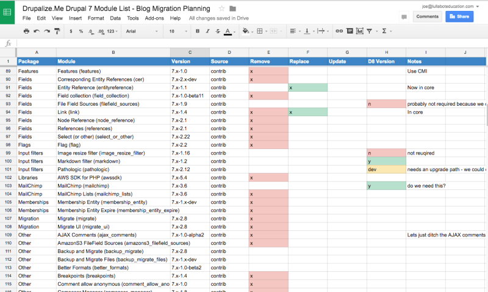

# Drupal-to-Drupal Migration Planning: Code Inventory

## Content

Before you can migrate your Drupal 7 site to the latest version of Drupal you'll need to be able to build the features that make up the current site. Part of this is evaluating all the modules you've got installed, figuring out what you're using them for, and if there's a version that's compatible with the latest version of Drupal along with a migration path.

I usually make a spreadsheet for this. But any list of the modules you’re currently using that allows you to keep track of how you plan to update them will work. You also want to keep track of where you are in the process of figuring that all out. Because it’s likely you’ll have some modules for which the path is clear, and others where it’s pretty murky and requires more in-depth research to find a path forward. Having a list means you can break that up into tasks, and ensure you’re not missing something. It'll also help you define when your migration is done as well as any final quality assurance (QA) tasks.

In this tutorial we'll:

- Start a list of the modules that make up our current site.
- Point to some tools that can help speed up the process of evaluating a module's readiness.
- Provide a set of questions that you can ask about each module you're using as part of your planning process.

By the end of this tutorial you should have a list of all the modules you're currently using, and some tools you can use to help you figure out how to move forward with each one.

## Goal

Create an inventory of the code that makes up your Drupal 7 site so that you'll know exactly what you need to do to re-create the same features in Drupal 10.

## Prerequisites

- [Prepare for a Drupal-to-Drupal Migration](https://drupalize.me/tutorial/prepare-drupal-drupal-migration)

## Start a spreadsheet and take lots of notes

I like to create a spreadsheet for tracking the modules on my Drupal 7 site, and the content I plan to migrate. [Example spreadsheet](https://docs.google.com/spreadsheets/d/1zFKymH1rbZ8PNom7XdE6FkQrXQDtsKtFQQzdiK4tLVg/edit#gid=1657143759).

For modules, start by listing all the modules you've currently got enabled. Add columns for tracking important details:

- Is this a contributed module or a custom module?
- Do you need this module in your destination Drupal site
- If so, does the module have a version for the latest version of Drupal?
- For custom modules, are you going to need to update the module yourself or can you replace it with a contributed module at this point?

Here's an example of the spreadsheet I created for tracking the modules on Drupalize.Me in preparation for migrating [our blog](https://drupalize.me/blog) content to the latest Drupal version.

Image



And here's an example from our Drupal-to-Drupal Migration workshop: <https://docs.google.com/spreadsheets/d/1zFKymH1rbZ8PNom7XdE6FkQrXQDtsKtFQQzdiK4tLVg/edit?usp=sharing>

**Tip:** You can use Drush to create a CSV file listing all your enabled modules and import that as a starting point.

```
drush pm-list --type=module --status=enabled --format=csv > module_list.csv
```

Sprout Video

This list of modules is part of your migration plan. Until you can look at this spreadsheet and feel confident that you have a valid update path for every module on the list (even if that's simply to ignore the module) you're not going to be able to successfully complete your migration. You can also use this list at the beginning of the project to begin to assess the amount of work that will be involved in attaining feature parity between your Drupal 7 and destination Drupal applications. If you keep it up-to-date as you progress, it'll be a valuable resource for everyone on the team to be able to check-in and get a sense of the current state of things.

## Upgrade Status and Contrib Tracker

There are 2 modules that can help with this evaluation process. You install Upgrade Status on a development copy of your Drupal 7 site. Then let it scan your codebase. Upgrade Status generates a report that indicates which modules have releases compatible with the latest version of Drupal. It can also make additional recommendations for popular alternatives. Learn more in [Use Upgrade Status and Contrib Tracker](https://drupalize.me/tutorial/use-upgrade-status-and-contrib-tracker).

## Create a copy of your Drupal 7 site

Make sure you're working on a copy of your Drupal 7 site during this migration planning and testing, and not the production version of your site. Throughout the process we'll be making changes to our Drupal 7 site in order to make it easier to migrate, and you don't want to accidentally break your live site while testing.

I recommend automating the ability to reset your development version of the Drupal 7 site and to copy the database from the live site so that you're working with up-to-date data during your testing.

## Assessing a module's readiness

One of the more challenging aspects of upgrading to the latest version of Drupal is going to be assessing the readiness of each module used on your existing site. Specifically we need to answer the compound question, "If I still need this module, is there a current Drupal version that supports data migration?" This is where having taken the time to evaluate our application and our needs going forward will help out. At this point, it's time to roll up your sleeves and go through every module on that list you just created and start doing your research.

### Do I still need this module?

A lot of the most popular modules in Drupal 7 have been moved into the current core software. I like to make note of those modules in my spreadsheet so I can remember that I need them enabled in my destination Drupal site, but that I don't need to worry about tracking whether they've been ported.

A better question to ask may be: "Do I need the functionality this module provides anymore?" This is a good time to make notes about any modules you plan on getting rid of because you're not planning to use their functionality. Assess where you might be able to reduce custom code in favor of using a contributed module that maybe didn't exist when you started your project years ago. You won't need to do anything on the Drupal 7 side of things with these modules, but it will help inform how you prepare your destination Drupal site later.

These decisions should all be noted in your tracking spreadsheet.

### Is there a compatible version?

Is there a version of the module available that is compatible with the latest version of Drupal?

The [Contrib Tracker project](https://www.drupal.org/project/contrib_tracker) on Drupal.org has status information about the availability of a current Drupal version for most of the popular modules. You can also check the Drupal.org project page for each module to see if there's a current Drupal version of the module available.

Or, use the [Upgrade Status module](https://www.drupal.org/project/upgrade_status) to automatically check each enabled module on your Drupal 7 site.

View the tutorial on [using Upgrade Status and Contrib Tracker](https://drupalize.me/tutorial/use-upgrade-status-and-contrib-tracker) to evaluate that status of your modules.

Finally, if the module in question doesn't have a release available that is compatible with the latest version of Drupal, here's what you'll have to decide now.

- Is there an open issue in the project's issue queue regarding porting the module to the latest version of Drupal? If so, what's the status? If not, now would be a good time to create an issue.
- Can you substitute another module to accomplish the same or similar functionality? For example, there are a lot of modules that provide social sharing widgets. If the one you're using hasn't been updated, is there another one you could use instead?
- Do you (or your team) have the ability to update the module to the latest version of Drupal yourselves so that you can make use of it?
- Can you pay someone else to update the module to the latest version of Drupal so you can make use of it?
- Are you willing to forgo this functionality on your site in order to alllow for the site to be migrated to the latest version of Drupal?
- Will you need to just wait until someone else updates the module?

### Does the module support migration?

Not every module that has a latest-Drupal version supports migration of Drupal 7 data--and not every module needs to.

In Drupal, individual modules need to provide a migration path for their own data and configuration. Of course this only applies to modules that provide data (e.g., Commerce, Organic Groups, Profile2, Pathauto), or configuration (e.g., Pathauto, Display Suite, Panels, XML sitemap). An easy way to find out if the module supports migrations is by looking at the source code of the module. If there are migration YAML files you're likely in good shape. If not, well, you've got another decision to make.

If the module doesn't support migrations:

- Is there an issue already in the module's queue related to providing a migration path? If so, this is likely the best place to find out what the current status of this work is.
- Can you help update the module and write the necessary plugins to support a migration path?
- If this module only provides configuration and not content you might be okay. A module like Prism.js, for example, which just has a handful of configuration settings, doesn't necessarily require a migration path. You can simply install the module on your destination Drupal site and configure it manually using the same settings you are using in Drupal 7.

Remember to add notes about what you discover here to your tracking spreadsheet. Especially if the module in question is going to entail work beyond just installing it on your destination Drupal site.

## Watch out for patched modules

It's not uncommon to customize contributed modules by applying patches that haven't yet made it into a release, or tweaking things for your application-specific needs. Before performing a migration you'll want to figure out what, if any, changes have been made, and whether those changes need to be maintained for your destination Drupal site.

If you've got this information already documented for your site, you're in luck. This is exactly why we recommend documenting the patches you apply. If not, I recommend trying the [Hacked module](https://www.drupal.org/project/hacked), which helps to automate the process of locating modules that have been customized.

Visit the [Check for Altered Modules with Hacked](https://drupalize.me/tutorial/check-alterations-hacked) tutorial for a detailed look at using the Hacked module.

## What about your custom code?

If you've got custom code you're going to need to handle upgrading it. Before you do, analyze the current code and see if there's anything you can replace with a new contributed module, or don't need anymore. Don't update code you're no longer using.

You can use [Drupal Module Upgrader](https://www.drupal.org/project/drupalmoduleupgrader) to help get started. Install it on your destination Drupal site and it'll scan your Drupal 7 code and make recommendations on how to update it. It's not perfect, but it does make things a lot faster. It's also currently only capable of outputting code compatible with Drupal 9. If you're targeting something higher than that you could then use [Drupal rector](https://www.drupal.org/project/rector) to help updating the use of any deprecated Drupal 9 code.

You can also browser the [change records](https://www.drupal.org/list-changes) to find specific examples of how to upgrade code.

## Recap

In this tutorial we learned about the importance of doing an analysis of your Drupal 7 site's code and creating an inventory as part of the planning and preparation phase of a Drupal-to-Drupal migration. This will help to inform where you need to focus your development efforts to replicate the required features of your current site. There are some tools you can use to help get started. Ultimately you'll want to spend the time going through a set of questions for each module and figuring out your path forward.

## Further your understanding

- What modules are you currently using that you want to replace with something different in Drupal 10? How does that impact your migration plans?
- Are there Drupal contributed modules, or new approaches to building things with core, that allow you to get rid of any custom code?

## Additional resources

- [Drupal-to-Drupal Migration Planning: Content Inventory](https://drupalize.me/tutorial/drupal-drupal-migration-planning-content-inventory)
- [Hacked module](https://www.drupal.org/project/hacked) (Drupal.org) — and [our tutorial on how to use it](https://drupalize.me/tutorial/check-alterations-hacked)
- [Upgrade Status module](https://www.drupal.org/project/upgrade_status) (Drupal.org) — and [our tutorial on how to use it](https://drupalize.me/tutorial/use-upgrade-status-and-contrib-tracker)
- [Contrib Tracker project](https://www.drupal.org/project/contrib_tracker) (Drupal.org) — and [our tutorial on how to use it](https://drupalize.me/tutorial/use-upgrade-status-and-contrib-tracker)
- [Jumpstart Your Drupal 9 Upgrade with Drupal Rector](https://www.palantir.net/blog/jumpstart-your-drupal-9-upgrade-drupal-rector) (palantir.net)

Was this helpful?

Yes

No

Any additional feedback?

Previous
[Upgrade to a New Version of Drupal with a Drupal-to-Drupal Migration](/tutorial/upgrade-new-version-drupal-drupal-drupal-migration?p=3116)

Next
[Use Upgrade Status and Contrib Tracker](/tutorial/use-upgrade-status-and-contrib-tracker?p=3116)

Clear History

Ask Drupalize.Me AI

close