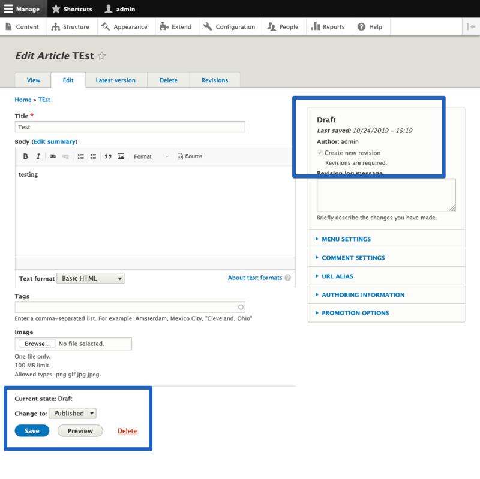
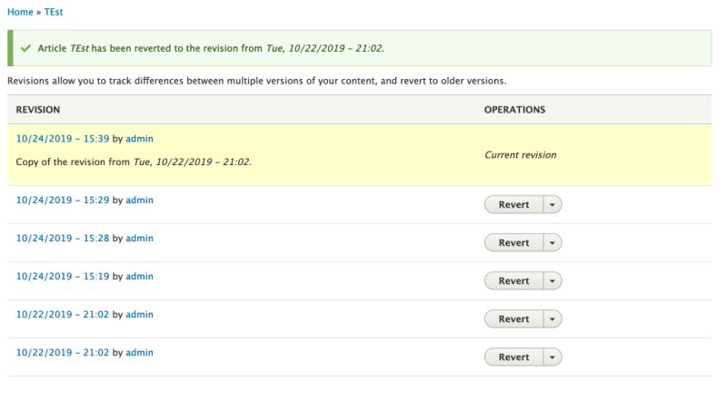

# Manage Moderated Content

## Content

The Content Moderation module allows you to apply an editorial workflow to your content. Doing so changes some of the ways that content managers will mark an item as published, archive an item, or create new revisions.

In this tutorial we'll:

- Look at the changes to the content editing form that happen when you apply an editorial workflow
- Learn how to edit a piece of content to change its state, and transition it through the editorial workflow

By the end of this tutorial you'll know how to create, and manage, content in an editorial workflow.

## Goal

Create a new piece of content within an editorial workflow, and then transition that content through the states of the workflow.

## Prerequisites

- [Apply an Editorial Workflow to a Content Type](https://drupalize.me/tutorial/apply-editorial-workflow-content-type)
- This tutorial assumes you're using the default *Editorial* workflow. The process is the same for any workflow, but the states and transitions may vary.

## Video walk-through

Sprout Video

## Add new moderated content

Content Moderation adds a *Save as* field to the bottom of the content form; this replaces the publishing checkbox on publishable entity types. Here all the valid moderation states to transition to are listed. To be valid it has to be both a possible transition from the current state, and allowed based on the current user's permissions.

### Choose the type of content to create

In the Manage administration menu navigate to *Content* (*admin/content*), then click the button labeled *Add content*.

Choose the type of content you want to create.

### Choose a state for the new content

After filling out the form, use the *Save as* select field to choose a state, and click the *Save* button.

Image

Selecting an option and clicking save will create a new item of content with the given moderation state, and the publishing status for that state. When editing existing content the current state will be listed above the moderation state field.

## Edit existing content to change the state

When you are logged in as a user with content moderation-related permissions, you will see a content moderation block containing a form to quickly change the moderation state when you view a content node.

Image

The current state is also displayed alongside other metadata at the top right of the form when you edit content. And you can change the state using the *Change to:* dropdown field just above the *Save* button.

Image

## Create a draft (pending) revision

Some editorial workflows allow for pending revisions. That is, a revision that contains changes that have not yet been made public and represent what the content will look like in the future.

With the default *Editorial* workflow, pending revisions can be created by transitioning from the published state to the draft state.

### Locate the content to edit

Locate the content you want to edit, and click the *Edit* tab. Or, in the Manage administration menu navigate to *Content* (*admin/content*) and click the *Edit* button next to the content item in the list.

### Change the state and save

At the bottom of the content editing form locate the *Change to* field, and choose *Draft* from the list of available options. Then click the button labeled *Save*.

Image

When you save the form Drupal will create a new pending revision and leave the existing default revision published for anyone viewing the page.

Users with the correct permissions will see a menu tab, *Latest version*, on the content item's page, which leads to the pending revision of the content.

Image

## Publish a pending revision

To publish a pending revision, navigate to the *Latest version* tab for the content in question. Use the provided form to set the desired state. In most cases this will be "Published". Then click the button labeled *Apply*.

This will make the pending revision into the new default revision, and bump the old default revision into the archived state.

Alternatively, you can change the published version from the *Revisions* tab. Each existing revision is listed, and all non-default revisions have an action button that will make it the default version.

Image

## Revert to a previous revision

Sometimes you need to undo a change. The revisions system in Drupal keeps track of all previous changes to a content item. You can view those previous revisions, and revert to any one of them with just a few clicks.

### Location the version you want to revert to

Navigate to the *Revisions* tab for the piece of content you want to revert.

### Review the content

To review the old revision first click the date of the revision in question. This will show the content view page with the content from that previous revision loaded.

### Revert to the selected version

To perform the revert, navigate back to the *Revisions* tab, and click the button labeled *Revert* next to the revision you want to use.

This will present you with a form asking you to confirm the action. Once you confirm, Drupal will create a new revision (you always have to move forward in time) with the content of the selected previous revision, and then make that new revision the default revision.

Image

## Recap

In this tutorial we looked at the different tasks you can perform as part of moving content through an editorial workflow, including creating a new draft; transitioning a revision to a new state such as published; and creating a draft revision with changes to be applied in the future. Finally, we looked at how to revert to a previous version of a piece of content.

## Further your understanding

- Do you have any content with previous revisions? Can you find the list and see the changes that were made?
- What causes the options in the list of states to which you can move a content item to change?
- With the [Diff module](https://www.drupal.org/project/diff) installed you can compare two different revisions and view the changes between them.

## Additional resources

- [Diff module](https://www.drupal.org/project/diff) (Drupal.org)

Was this helpful?

Yes

No

Any additional feedback?

Previous
[Apply an Editorial Workflow to a Content Type](/tutorial/apply-editorial-workflow-content-type?p=2501)

Next
[Moderated Content and Views](/tutorial/moderated-content-and-views?p=2501)

Clear History

Ask Drupalize.Me AI

close