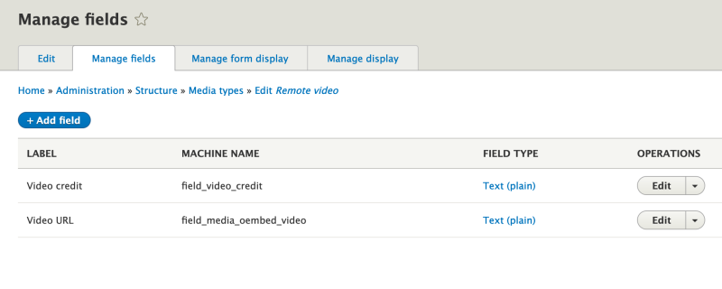

# Map Media Source Data to Custom Fields

## Content

Media Source plugins in Drupal have a powerful feature, called *field mapping*, that allows an administrator to configure a Media entity type to automatically populate the value of custom fields based on metadata retrieved from the source content. For example, you can add a creator field to the Remote Video Media type, which can use YouTube as a source. When a content author adds a new Remote Video entity they can provide a URL for the YouTube video. Then the source plugin can extract the creator's name from the YouTube API and use that data to populate a custom field. This saves the content author from having to do that work themselves.

In this tutorial we'll learn:

- How to discover what source metadata is available
- How to configure a Drupal Media type to automatically populate custom fields

By the end of this tutorial you should be able to add a custom field to a Media type on your Drupal site and automatically populate it with data retrieved from the source content.

## Goal

Update the Remote Video Media type and map author/owner data obtained from YouTube to a custom text field that can be displayed to users.

## Prerequisites

- [Overview: Media Types, Media Entities, and Media Fields in Drupal](https://drupalize.me/tutorial/overview-media-types-media-entities-and-media-fields-drupal)
- [How to Add Fields to a Media Type in Drupal](https://drupalize.me/tutorial/how-add-fields-media-type-drupal)

## Watch: Map Media Source Data to Custom Fields

Sprout Video

## Add custom fields and populate them with metadata

### Add a credit field to the *Remote Video* media type

In the *Manage* administration menu, navigate to *Structure* > *Media types*, then choose the *Manage fields* operation for the Remote video type (admin/structure/media/manage/remote\_video/fields).

From here, add a new *Text (plain)* field named "Video credit". This field will store the name of the person we want to give credit to for creation of the video.

Image

Learn more in [How to Add Fields to a Media Type in Drupal](https://drupalize.me/tutorial/how-add-fields-media-type-drupal).

### Map data from the source plugin to the video credit field

Navigate to the *Edit* tab for the Remote video Media type (admin/structure/media/manage/remote\_video). In the *Field mapping* section you'll see a list of all the source fields available to populate custom fields on the Media type. Each one has a `select` list under it which allows you to choose a custom field you would like to save the extracted data to.

Find *The name of the author/owner* in the list, and set select list to the *Video credit* field created in the previous step.

<drupal-media data-entity-type="media" data-entity-uuid="26d0926f-da06-4890-bcb7-8805680ab8f1" alt="Screenshot of field mapping options with Video credit selected in the select widget under the label "The name of the author/owner".">

**Note:** Notice the *Resource title* source field is already mapped to the *Name* field. This is the default configuration provided by the Media module.

Then press the *Save* button at the bottom of the page.

### (Optional) Hide the custom field on the entity edit form

When using field mapping, the data extracted from the source will **only be added to the custom field if the custom field is empty**. If you know for certain that you only ever want the field populated with source data you can hide it from content authors so they are not tempted to fill it in. This ensures they'll not enter any content and that it will get automatically populated. But beware -- it also means they won't be able to edit the field value.

Navigate to the *Manage form display* tab for the Remove video Media type (admin/structure/media/manage/remote\_video/form-display). Then move the *Video credit* field into the *Disabled* section and press *Save*.

Image

Now, when a user creates a new Remote video entity, the new Video credit field (and existing Name field) will be automatically populated with data extracted from the YouTube or Vimeo source.

## Known issues

### Complex field types

The current system is limited to *simple* single value field types and doesn't work with complex or multi-value fields. So:

- You can't map values to multi-property fields like Link fields. Currently, values map to the field's main property, but in the case of a Link field with `uri` and `title` fields it's not possible to map to the `uri` property.
- You can't pre-process metadata before assigning it to a field. For example, you can't split a comma-separated list of tags into a multi-value entity reference field.
- Multiple value fields are not supported.

You can work around these issues by writing use-case specific solutions. But there is not a generic approach. See [Add complex field mapping to media module](https://www.drupal.org/project/drupal/issues/2862467) for more information.

### Refreshing data from the source

Right now, there's no UI for updating the value of a field with new data from the remote source. For example, if the authoring information of a video changes in YouTube it will not automatically update in Drupal. There's ongoing work in [this issue](https://www.drupal.org/project/drupal/issues/2983456) to expose a UI that will allow a content editor to manually trigger an update.

## Recap

In this tutorial, we demonstrated how to use Media type source field mapping to automatically populate the value of a custom field using data from the source at the time the Drupal Media entity gets created. We demonstrated this using a Video credit field on the Remote video media type. Finally, we discussed some caveats to be aware of when using source field mapping.

## Further your understanding

- Can you think of examples where using source field mapping like this would be beneficial in your application?
- Check what fields are available for mapping on the other Media types on your site.
- Why can you not successfully map a value to an Image field?
- If the source plugin doesn't provide the metadata for mapping that you want to access, you can implement a new Media source plugin that extends the existing one and override the `\Drupal\media\MediaSourceInterface::getMetadataAttributes` and `\Drupal\media\MediaSourceInterface::getMetadata` methods to collect the data you need. How could you do this to collect location EXIF data from an image, and then use that data to place the image on a map?

## Additional resources

- [Creating and configuring Media Types](https://www.drupal.org/docs/8/core/modules/media/creating-and-configuring-media-types) (Drupal.org)
- [Issue: On-going work to allow updating metadata after a Media entity is created](https://www.drupal.org/project/drupal/issues/2983456) (Drupal.org)

Was this helpful?

Yes

No

Any additional feedback?

Previous
[How to Add Fields to a Media Type in Drupal](/tutorial/how-add-fields-media-type-drupal?p=2672)

Next
[Overview: Access Control for Media Entities in Drupal](/tutorial/overview-access-control-media-entities-drupal?p=2672)

Clear History

Ask Drupalize.Me AI

close