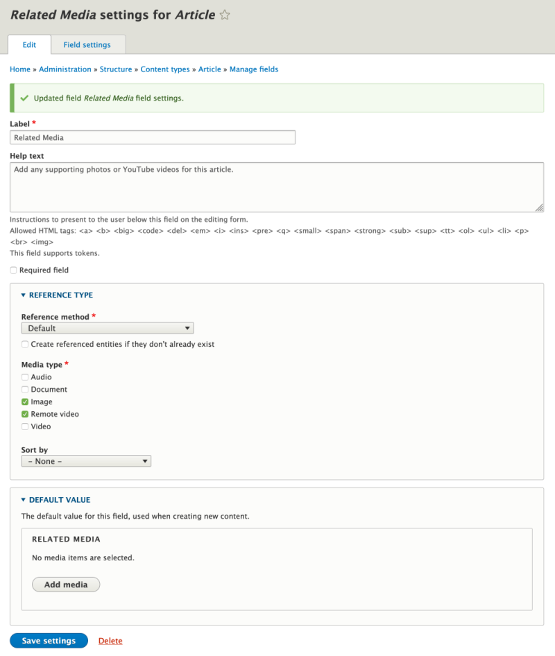

# Add a Media Field to a Content Type in Drupal

## Content

The most common way to use Drupal's Media items is to add fields to content types, allowing the Media entities to be associated with one or more pieces of content. For example, adding a cover image to an article, or embedding a set of YouTube videos into a tutorial. This is accomplished by adding a Media field to the content type in question.

In this tutorial we'll:

- Explain what the different Media field-specific configuration options do
- Add a Media field to the existing *Article* content type
- Explain what the different field-specific configuration options do
- Confirm that it worked by verifying that the form for adding an article has the new field

By the end of this tutorial you'll know how to add a Media field to any content type, or any other fieldable entity, in order to allow Media items to be associated with the content.

## Goal

Add a media field to the *Article* content type in Drupal.

## Prerequisites

- [6.3. Adding Basic Fields to a Content Type](https://drupalize.me/tutorial/user-guide/structure-fields)
- [6.4. Concept: Reference Fields](https://drupalize.me/tutorial/user-guide/structure-reference-fields?p=3071)

## Watch: Add a Media Field to a Content Type in Drupal

Sprout Video

## Use a Media field for an image

A common question is whether you should use a Media field or an Image field to add images to content. This especially pertains to Drupal users who are already accustomed to the Image and File fields which have been part of core for a long time.

Our recommendation is that **in almost all cases you should use a Media field**, whether adding a cover image field that collects a single value, or a slide show field that collects an unlimited number of images. We think the added flexibility this gives you to make changes going forward, and the fact that it allows images to be reused, are things you'll appreciate later.

## Add a Media field to the Article content type

The rest of this tutorial assumes that you've already installed the Media module, and that you're already familiar with the basics of adding fields to content types. We'll focus on the aspects specific to the Media module.

Note that the resulting field will look different on the content authoring form depending on whether or not you have the Media Library module enabled. If not, you'll get a standard entity reference widget with a few Media-specific additions. If enabled, you'll get the Media Library enhanced reference widget. We'll go into more detail about the Media Library widget in another tutorial.

### Add a Media reference field

In the manage administration menu, navigate to *Structure* > *Content types* (*admin/structure/types*) and then select *Manage fields* from the *Operations* dropdown in the *Article* row. On the resulting page press the *Add field* button. Then choose the *Media* option in the *Add a new field* select list.

Fill in the *Label* field. Example: "Related Media"

<drupal-media data-entity-type="media" data-entity-uuid="e734a8bc-e5e1-4557-9ef8-c3fbab6e1165" alt="Add new field form with "Media" field type selected and label field populated with "Related media"">

Then press *Save and continue*.

### Configure the number of items that can be referenced

On the next page, you can choose whether or not you want to limit the number of Media items that can be associated with an Article. If you choose a specific number, content authors will be able to add any number of media items less than or equal to the limit. Set it to unlimited to not impose any restrictions.

Image

This will save the new field and display a message like "Updated field Related Media field settings."

### Configure the Media reference field widget

Next, you'll end up on the form for configuring the field. Here, you can add help text, make the field required or not, and most importantly, configure what media types are allowed to be referenced from this field.

Image

In the *Reference type* section are options related to configuring the underlying entity reference field.

**Note:** Most of the settings here, with the exception of *Media type*, will have no impact if you're using the Media Library module provided widget (which you should) for selecting media items. [Use Media Library to Browse Media Items](https://drupalize.me/tutorial/use-drupal-media-library-browse-media-entities). These settings are a byproduct of the fact that behind the scenes a Media field is an entity reference field with some additional polish.

The Default *Reference method* refers to the commonly used entity reference autocomplete textfield. This is fine for now; later we'll replace the widget with the much more useful Media Library widget.

The *Media type* checkboxes allow you to specify which of the different media types you have configured for your site can be inserted into this field. You'll need to choose at least one. In our experience, it's rare to have a single catch-all media field, and you're likely to want multiple media fields that accept only specific media types. For example: a field to attach documents that you want someone to download; a field to attach a cover image for the article; and a field to associate any optional videos.

This is for 2 reasons. First, it allows for granular control over how, and where, things are displayed. You're probably not going to display both the cover image and a list of PDFs in the same spot. Second, it keeps your data semantically structured, which is always a good idea.

The *Sort by* option allows you to specify which field on the referenced Media entities will be used to order the results of the autocomplete entity reference textfield. See below for example.

Image

### Save the new field

Once you've configured the field, press *Save settings* at the bottom of the page. You'll end up back on the *Manage fields* tab for the Article content type.

### Verify it's working

To confirm it worked, create a new Article by navigating to *Content* (admin/content), pressing the *Add content* button, and choosing *Article* from the list. On the form for adding an Article you'll see 1 of 2 things depending on whether you've got the Media Library module installed or not (we'll go into much more detail on this later).

A default entity reference widget with a few Media related enhancements (no Media Library module). Did you notice the *media add page* and *media list* links? These are added by the Media module and are shortcuts to help make it easier to add new media entities, or figure out the name of existing ones.

Image

Or, an *Add media* button (Media Library module installed):

Image

### Create an Article with attached media

Fill in the form to create a new Article node. Either reference an existing media entity, or click the *media add page* link to add one, and then reference it. Learn to [Add and Administer Media Entities](https://drupalize.me/tutorial/find-add-edit-and-delete-media-entities-drupal).

Click *Save* to save and view the new article. If successful, you should also see the attached media.

At this point you can now attach a media entity to an article. It's similar to how you might have attached an image using an Image field in the past. Now, the media entity is displayed as part of the article's content using the default configuration. The real power of the Media system is in the way you can customize it for your use-case. You can change the way things are displayed, customize the media selection widget, collect additional metadata, and much more.

## Recap

In this tutorial, we added a new Related media field to the existing Article content type. The field uses the new Media reference field type that allows Media entities to be associated with other entities. We looked at the configuration options available for the field. We mentioned that the field works differently depending on whether or not you have the Media Library module enabled. Finally, we verified it's working by checking the form for adding new articles.

## Further your understanding

- Check out the different configuration options for the entity reference widget in *Manage form display* settings for the *Article* content type.
- Learn more about the [Media Library](https://drupalize.me/tutorial/use-drupal-media-library-browse-media-entities) module's improved media selection widget.

## Additional resources

- [6.4. Concept: Reference Fields](https://drupalize.me/tutorial/user-guide/structure-reference-fields?p=3071) (Drupalize.Me)
- [6.8. Concept: Forms and Widgets](https://drupalize.me/tutorial/user-guide/structure-widgets?p=3071) (Drupalize.Me)

Was this helpful?

Yes

No

Any additional feedback?

Previous
[Overview: Media Types, Media Entities, and Media Fields in Drupal](/tutorial/overview-media-types-media-entities-and-media-fields-drupal?p=2672)

Next
[Find, Add, Edit, and Delete Media Entities in Drupal](/tutorial/find-add-edit-and-delete-media-entities-drupal?p=2672)

Clear History

Ask Drupalize.Me AI

close