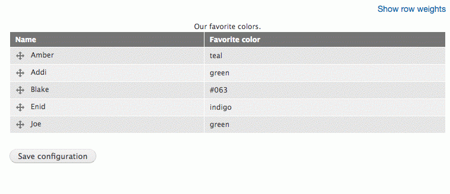

# Output a Table

## Content

The `#table` render element type is a powerful way to output an array of rows and columns as an HTML table. It supports all the features of a standard HTML `<table>` element like headers, captions, and column groups. Data to be displayed in the table can be an array of simple string values, or an array of render arrays where each sub element is a row with columns as child elements. In addition, when used in the context of a form, tables can be made into a multiple select widget, or have drag-and-drop reordering of rows enabled. Whether you just want to display a set of tabular data, or you provide your users with a complex form element for reordering and nesting items inside a menu tree, it can all be done with the `#table` element.

In this tutorial we'll:

- Look at outputting simple strings as a table
- Provide definitions for all the various properties that can be used to define a table element
- Demonstrate how to use the `#tableselect` and `#tabledrag` options to create complex form widgets

By the end of this tutorial you should be able to create HTML tables in all their various permutations as part of a render array.

## Goal

Use a `'#type' = 'table'` render element to create an HTML table as part of a render array.

## Prerequisites

- [What Are Render Arrays?](https://drupalize.me/tutorial/what-are-render-arrays)

One of the more commonly used [render element types](https://api.drupal.org/api/drupal/elements) for output HTML content is the `#table` element type. It provides an efficient way to convert an array of records into an HTML table, as well as the ability to make the table responsive, use sticky headers, and click sort on a column, all by toggling a few properties on or off.

The definition of the table render element is provided by `\Drupal\Core\Render\Element\Table`.

The table element type is an excellent example of how render elements can be used to encapsulate complex but relatively boilerplate logic into reusable chunks.

Example:

```
$build['table'] = [
  '#type' => 'table',
  '#caption' => $this->t('Our favorite colors.'),
  '#header' => [$this->t('Name'), $this->t('Favorite color')],
  '#rows' => [
    [$this->t('Amber'), $this->t('teal')],
    [$this->t('Addi'), $this->t('green')],
    [$this->t('Blake'), $this->t('#063')],
    [$this->t('Enid'), $this->t('indigo')],
    [$this->t('Joe'), $this->t('green')],
  ],
  '#description' => $this->t('Example of using #type.'),
];
```

Example output:

```
<table class="responsive-enabled" data-striping="1">
<caption>Our favorite colors.</caption>
  <thead>
    <tr>
      <th>Name</th>
      <th>Favorite color</th>
    </tr>
  </thead>
  <tbody>
    <tr class="odd">
      <td>Amber</td>
      <td>teal</td>
    </tr>
    <tr class="even">
      <td>Addi</td>
      <td>green</td>
    </tr>
    <tr class="odd">
      <td>Blake</td>
      <td>#063</td>
    </tr>
    <tr class="even">
      <td>Enid</td>
      <td>indigo</td>
    </tr>
    <tr class="odd">
      <td>Joe</td>
      <td>green</td>
    </tr>
  </tbody>
</table>
```

## Element-specific properties

The documentation of table element properties can be a little bit tricky to locate. We've tried to compile a complete list here. But if you want to look at the code where these properties are used, take a look at `\Drupal\Core\Render\Element\Table`, `template_preprocess_table()`, and *core/modules/system/templates/table.html.twig*.

### #header

**#header**: An array containing the table headers. Each element of the array can be either a localized string or an associative array with the following keys:

- **data**: The localized title of the table column, as a string or render array.
- **class**: An array of values for the `class` attribute. In particular, the least important columns that can be hidden on narrow- and medium-width screens should have a `priority-low` class, referenced with the `RESPONSIVE_PRIORITY_LOW` constant. Columns that should be shown on medium and wide screens should be marked up with a class of `priority-medium`, referenced by with the `RESPONSIVE_PRIORITY_MEDIUM` constant. Themes may hide columns with one of these two classes on narrow viewports to save horizontal space.
- Any HTML attributes, such as `colspan`, to apply to the column header cell.
- **field**: The database field represented in the table column (required if user is to be able to sort on this column).
- **sort**: A default sort order for this column (`asc` or `desc`). Only one column should be given a default sort order because table sorting only applies to one column at a time.

### #rows

**#rows**: An array of table rows. Every row is an array of cells, or an associative array with the following keys:

- **data**: An array of cells.
- Any HTML attributes, such as `class`, to apply to the table row.
- **no\_striping**: A Boolean indicating that the row should receive no "even/odd" styling. Defaults to `FALSE`.

Each cell (row in the data array) can be either a string or an associative array with the following keys:

- **data**: The string or render array to display in the table cell.
- **header**: Indicates this cell is a header.
- Any HTML attributes, such as `colspan`, to apply to the table cell.

Example:

```
$rows = [
  // Simple row.
  ['Cell 1', 'Cell 2', 'Cell 3'],
  // Row with attributes on the row and some of its cells.
  ['data' => ['Cell 1', ['data' => 'Cell 2', 'colspan' => 2]], 'class' => ['funky'],
];
```

Output example:

```
<table data-striping="1">
<tbody>
  <tr class="odd">
    <td>Cell 1</td>
    <td>Cell 2</td>
    <td>Cell 3</td>
  </tr>
  <tr class="funky even">
    <td>Cell 1</td>
    <td colspan="2">Cell 2</td>
  </tr>
</tbody>
</table>
```

### #colgroups

**#colgroups**: An array of column groups. Each element of the array can be either:

- An array of columns, each of which is an associative array of HTML attributes applied to the `<col>` element.
- An array of attributes applied to the `<colgroup>` element, which must include a `data` attribute. To add attributes to `<col>` elements, set the `data` attribute with an array of columns, each of which is an associative array of HTML attributes.

These optional tags are used to group and set properties on columns within a table. For example, one may easily group three columns and apply the same background style to all.

```
$colgroup = [
  // <colgroup> with one <col> element.
  [
    [
      // Attribute for the <col> element.
      'class' => ['funky'],
    ],
  ],
  // <colgroup> with attributes and inner <col> elements.
  [
    'data' => [
      [
        // Attribute for the <col> element.
        'class' => ['funky'],
      ],
    ],
    // Attribute for the <colgroup> element.
    'class' => ['jazzy'],
  ],
];
```

Output example:

```
<table data-striping="1">
  <colgroup>
    <col class="funky">
  </colgroup>
  <colgroup class="jazzy">
    <col class="funky">
  </colgroup>
...
</table>
```

### #footer

An array of table rows which will be printed within a `<tfoot>` tag, in the same format as the rows element (see above).

### #caption

**#caption**: A localized string to use for the `<caption>` tag.

### #empty

**#empty**: Text to display when no rows are present.

### #responsive

**#responsive**: Indicates whether to add the `drupal.responsive_table` library providing responsive tables. Defaults to `TRUE`.

### #sticky

**#sticky**: Indicates whether to add the `drupal.tableheader` CSS and JavaScript library that makes table headers always visible at the top of the page. Defaults to `FALSE`.

### #size

**#size**: The size of the input element in characters. For tables used in a form.

### #tableselect

**#tableselect**: When used in the context of a form, set to TRUE in order to insert a checkbox as the first column of every row. Functions like a multiple select form element. Additionally, add the `'#tableselect' => TRUE` property to the submit button for the form in order to add validation for the table select element.

Example:

```
$form['actions']['submit']['#tableselect'] = TRUE;
```

When using `#tableselect` the table's rows should be defined as sub-elements of the `#table` element rather than as values in the `#rows` array. See the `#tabledrag` example below for more information about how to do that.

Example `#tableselect` enabled table:

Image


## Drag-and-drop reordering of table rows

When used in the context of a form you can use the `#tabledrag` property to define a table with rows that can be reordered using JavaScript for drag-and-drop. For example, the page that allows you to reorder the items in a menu. This is a great way to provide a standard UI element, and can be done entirely via configuration of the render element.

Image



Adding drag-and-drop functionality to a table requires:

- Adding the `#tabledrag` property with configuration options for `drupal_attach_tabledrag()`
- Defining rows of the table as nested sub elements of the `#table` element instead of using the `#rows` property
- Adding the class `draggable` to each row that should be drag-and-drop enabled
- Defining a form field in each row that contains the weight of the row

Example:

```
$form['tabledrag'] = [
  '#type' => 'table',
  '#id' => 'draggable-table',
  '#caption' => $this->t('Our favorite colors.'),
  '#header' => [
    $this->t('Name'),
    $this->t('Favorite color'),
    $this->t('Weight'),
  ],
  // #tabledrag can be used on #table elements in the context of a form.
  // When enabled, the table will be rendered with a drag & drop interface
  // that can be used to re-order elements within the table. Any changes you
  // make to the order will be made available to your validation and submit
  // handlers via values in $form_state->getValues().
  //
  // The #tabledrag property contains an array of options passed to the
  // drupal_attach_tabledrag() function. These options are used to generate
  // the necessary JavaScript settings to configure the tableDrag behavior
  // for this table.
  //
  // For more in-depth documentation of the options below see
  // drupal_attach_tabledrag().
  '#tabledrag' => [
    [
      // The HTML ID of the table to make draggable. See #id above.
      'table_id' => 'draggable-table',
      // The action to be done on the form item. Either 'match' 'depth', or
      // 'order'.
      'action' => 'order',
      // String describing where the "action" option should be performed.
      // Either 'parent', 'sibling', 'group', or 'self'.
      'relationship' => 'sibling',
      // Class name applied on all related form elements for this action.
      // See below.
      'group' => 'table-order-weight',
    ],
  ],
  // Rather than defining the values to insert into the table using the
  // #rows property you can define each row as a sub element of the table
  // render array. And each column in the row as a sub element of the row
  // array.
  [
    // Apply the 'draggable' class to each row in the table that you want to
    // be made draggable.
    '#attributes' => ['class' => ['draggable']],
    // The first two columns are render arrays that display a string of
    // text.
    'name' => ['#plain_text' => $this->t('Amber')],
    'color' => ['#plain_text' => $this->t('teal')],
    // The third column is a #weight form field.
    'weight' => [
      '#type' => 'weight',
      '#title_display' => 'invisible',
      // Set the default value to whatever the current weight, or order, of
      // the element that this row represents is.
      '#default_value' => 1,
      // Set a class on each field that represents the value to manipulate
      // when the table is reordered. The name of this class should match
      // the value used for the 'group' argument in the #tabledrag property
      // above.
      '#attributes' => ['class' => ['table-order-weight']],
    ],
  ],
  // The rest of this array is additional rows so there is some data in the
  // table to drag around.
  [
    '#attributes' => ['class' => ['draggable']],
    'name' => ['#plain_text' => $this->t('Addi')],
    'color' => ['#plain_text' => $this->t('green')],
    'weight' => ['#type' => 'weight', '#title_display' => 'invisible', '#default_value' => 2, '#attributes' => ['class' => ['table-order-weight']]],
  ],
  [
    '#attributes' => ['class' => ['draggable']],
    'name' => ['#plain_text' => $this->t('Blake')],
    'color' => ['#plain_text' => $this->t('#063')],
    'weight' => ['#type' => 'weight', '#title_display' => 'invisible', '#default_value' => 3, '#attributes' => ['class' => ['table-order-weight']]],
  ],
  [
    '#attributes' => ['class' => ['draggable']],
    'name' => ['#plain_text' => $this->t('Enid')],
    'color' => ['#plain_text' => $this->t('indigo')],
    'weight' => ['#type' => 'weight', '#title_display' => 'invisible', '#default_value' => 4, '#attributes' => ['class' => ['table-order-weight']]],
  ],
  [
    '#attributes' => ['class' => ['draggable']],
    'name' => ['#plain_text' => $this->t('Joe')],
    'color' => ['#plain_text' => $this->t('green')],
    'weight' => ['#type' => 'weight', '#title_display' => 'invisible', '#default_value' => 5, '#attributes' => ['class' => ['table-order-weight']]],
  ],
];
```

## Recap

The most efficient way to output a table in a render array is using the `#table` render element type. Data is defined as an array of rows and columns. The `#table` element can handle `<thead>`, rows, `<caption>`, and `<colgroups>`. It provides support for making headers sticky, drag & drop reordering, and making the table responsive, via custom properties.

## Further your understanding

- Can you find an example of `'#type' => 'table'` being used in Drupal core? What about one that uses the table sorting options? What content is being displayed by these examples?
- There are additional code examples in the documentation for `\Drupal\Core\Render\Element\Table`
- There are additional code examples in the documentation for `template_preprocess_table()`

## Additional resources

- [New render element #type 'table'](https://www.drupal.org/node/1876710) (Drupal.org)
- [Responsive table classes for modules and themes](https://www.drupal.org/node/1796238) (Drupal.org)

Was this helpful?

Yes

No

Any additional feedback?

Previous
[Output a List of Items](/tutorial/output-list-items?p=3252)

Next
[Output Content with a Template File](/tutorial/output-content-template-file?p=3252)

Clear History

Ask Drupalize.Me AI

close