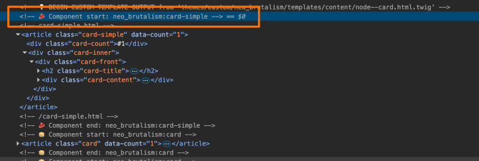

# Override an Existing Single Directory Component

## Content

Overriding Single Directory Components (SDCs) allows you to safely customize the functionality and appearance of components provided by contrib modules or themes. Instead of editing the original files, copy a component into your theme, declare that it replaces the original, and then make the necessary adjustments. This approach ensures our changes are upgrade-safe and easy to maintain.

In this tutorial, we will:

- Copy an existing SDC into a theme.
- Use the `replaces:` key in the component metadata to declare the override.
- Modify the component Twig, CSS, or JavaScript and confirm the changes appear on our site.

By the end of this tutorial, you should be able to override SDCs safely and maintain your customizations in an upgrade-safe manner.

## Goal

Override a `card` SDC provided by another theme or module to customize functionality and appearance while maintaining upgradeability.

## Prerequisites

- You should know how to create an SDC already, see [Create Your First Drupal Single Directory Component (SDC)](https://drupalize.me/tutorial/create-your-first-drupal-single-directory-component-sdc).
- [Add a Component YAML File for a Drupal SDC](https://drupalize.me/tutorial/add-component-yaml-file-drupal-sdc)
- A custom theme where you can place the overridden component.

## Important notes about overriding an SDC

- Only themes can override components.
- Overrides replace the original completely (no inheritance like template files).
- You must copy the entire component directory.
- A schema is required for a component to be overridden, and you should not modify it.

## Why override instead of hacking the existing SDC?

When you override an SDC in your theme, you ensure that your changes are upgrade-safe, updates to contributed modules or parent themes won't overwrite your changes, and the component is still recognized by Drupal as a drop-in replacement. For example, you might want to override a `card` component provided by a base theme to adjust its HTML structure to match your design, or simplify its markup. In all these cases, overriding with `replaces:` allows you to tailor Drupal's output without losing compatibility or risking that your edits get deleted during an update.

Let's walk through the process of overriding a theoretical `card` component provided by a module that our site is using.

### Identify which component is being used

Before we can override a component, we need to find out which one is currently being used to render the UI element we want to modify.

Start by enabling Twig debug mode. See [Configure Your Environment for Theme Development](https://drupalize.me/tutorial/configure-your-environment-theme-development).

Then run `drush cr` and view source. Look for HTML comments like `BEGIN COMPONENT: mytheme/components/card` which reveal the component name and provider.

Example:

Image



In this case, the component ID is `neo_brutalism:card-simple`. We can identify the project that provides the component (`neo_brutalism`) and the component name (`card-simple`), and know that we should look in the *components/* subdirectory of the project to find the directory that contains the currently used component.

### Copy the component into your theme

Locate the component you want to override (for example, *themes/contrib/neo\_brutalism/components/card-simple/*). Copy the entire *card-simple/* directory into your theme's *components/* directory, preserving the folder name.

Your theme now has its own version of the `card-simple` component.

### Add the `replaces:` key

Open the copied *card-simple.component.yml* file and add a `replaces:` key pointing to the original component:

```
name: card-simple
replaces: neo_brutalism:card-simple
...
```

Leave the rest of the *card-simple.component.yml* file intact.

This tells Drupal that your theme's version should take precedence, and whenever something calls for using the `neo_brutalism:card-simple` component, yours will be used instead.

### Modify the component

Edit the Twig, CSS, or JS files inside your theme's `card-simple` component directory. For example, you could update *card-simple.twig* to include an additional class:

```
<div class="card-simple card-simple--custom">
  {{ title }}
  <div class="card__content">{{ content }}</div>
</div>
```

Or add custom styles in *card-simple.css*:

```
.card-simple--custom {
  border: 2px solid var(--color-brand);
}
```

### Verify the override

To verify our customizations are working:

1. Clear Drupal's cache with `drush cr`.
2. Reload a page that uses the `card-simple` component.
3. Inspect the markup to confirm your changes (look for the `card-simple--custom` class).

If your changes don't appear:

- Double-check the `replaces:` value matches the original provider and component name.
- Make sure the component directory name matches exactly.
- Verify the component is being used at all (via Twig debug comments).

## Recap

Overriding SDCs enables us to safely customize module or theme-provided components without modifying their source code. By copying a component into our theme (remember only themes can override an SDC), declaring the override with `replaces:`, and making the necessary modifications, we can tailor components to our project's design and accessibility requirements while keeping upgrades safe.

## Further your understanding

- Why is it important not to change a component schema when overriding it?
- Experiment with overriding multiple components from a base theme to practice the workflow and identify common pitfalls.

## Additional resources

- [Annotated example component.yml](https://www.drupal.org/docs/develop/theming-drupal/using-single-directory-components/annotated-example-componentyml) (Drupal.org)

Was this helpful?

Yes

No

Any additional feedback?

Previous
[Use a Component in a Twig Template](/tutorial/use-component-twig-template?p=3329)

Clear History

Ask Drupalize.Me AI

close