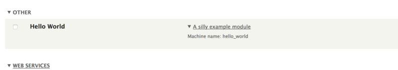

# Overview: Info Files for Drupal Modulesfree

## Content

In this tutorial, we'll examine one the first files you'll need in order to create a Drupal module: the *info file*. Each module is required to have a *MODULE.info.yml* file to help Drupal identify that a bundle of code is a unique module. This specially-formatted YAML file tells Drupal about the module and provides other useful metadata. In this tutorial, we'll walk through both required and optional information you put in a module's info file.

## Goal

Understand what information goes in a module info file. Be able to create an info file that accurately describes your custom module.

## Prerequisites

- It helps to know what YAML is, but we'll provide example code that you can copy and paste. See also [Introduction to YAML](https://drupalize.me/tutorial/introduction-yaml)
- You should understand the concept of a module in Drupal. See [Concept: Modules](https://drupalize.me/tutorial/user-guide/understanding-modules?p=2433) (Drupal User Guide)
- You should have a directory created for your custom module in *modules/custom/MODULE\_NAME* where *MODULE\_NAME* is the machine name of your module.

Learn more about naming and placing a module.

- [Anatomy of a Module](https://drupalize.me/tutorial/concept-anatomy-module) (Module Developer Guide)
- [Naming and placing your module](https://www.drupal.org/docs/develop/creating-modules/naming-and-placing-your-drupal-module) (Drupal.org)

## Related resource

See also [Create an Info File for a Module](https://drupalize.me/tutorial/create-info-file-module-mdg) in our Module Developer Guide.

## Contents

Use the following links to jump to a section below:

- [Required keys in an info file](#required_keys)
- [Optional keys in an info file](#optional_keys)
- [Basic example of an info file](#info_basic_example)
- [Declaring a dependency on 1 or more modules](#dependencies)
- [Point to settings form route with configure key](#configure)

## Required keys in an info file

Every Drupal module info file must contain certain keys in order for Drupal to be able to actually install the accompanying module. The required keys for non-core modules are:

- `name`: A **name** for your module.
- `type`: The **type** of package. For a module info file, specify `module`.
- `core_version_requirement`: The **semantic version(s)** of core compatible with your module

Source: [core/lib/Drupal/Core/Extension/InfoParserDynamic.php](https://api.drupal.org/api/drupal/core%21lib%21Drupal%21Core%21Extension%21InfoParserDynamic.php/11.x) (api.drupal.org)

## Optional keys in an info file

It can be helpful, or even necessary, to provide the following optional keys in your module:

- `description`: A brief **description** of its functionality (appears in the module listing on the *Extend* administrative page)
- `package`: Lists the module in a group with value specified. For example, use `Custom` to group all your custom modules in a group named "Custom" on the *Extend* page.
- `dependencies`: If applicable, provide a list of dependencies required by the module
- `lifecycle`: Specify the stability and maintenance status of your module (see below for example values)
- `configure`: Specify the name of the route to the module's configuration form. A link labeled "Configure" will appear in the module listing on the *Extend* page if a valid route is provided here.
- `hidden`: (true) Use if you want to hide your module from the list on Extend. Used most often for modules containing automated tests. To override this setting (and list all hidden modules), add `$settings['extension_discovery_scan_tests'] = TRUE` to your site's *settings.php*.
- `php`: Defines the minimal PHP version that is required for your module. Users will not be able to enable the module if they use an older PHP version. This can be used to avoid errors if your module uses newer functions that did not exist in earlier PHP versions. For example, `php: 8.0`.
- `test_dependencies`: This is used by DrupalCI only. The value is a list of other modules (in the same format as dependencies) that are needed to run certain automated tests for your module on Drupal's automated test runner ("DrupalCI"), but not needed as module dependencies in general. Note that you need to have the `test_dependencies` change committed to your Git repository before you try to run a test that depends on it. As an alternative, you can use Composer for test dependencies. See [Dependencies for tests](https://www.drupal.org/docs/develop/using-composer/managing-dependencies-for-a-contributed-project#s-dependencies-for-tests).

Further examples and explanations for these keys are provided below.

## Restricted: keys added by Drupal's packaging system

The following keys are added by Drupal's packaging system when `"preferred-install": "dist"` is specified in the project's *composer.json*. Don't add these to your custom module's info file.

- `version`: The version of Drupal. The value is often the global constant, `VERSION`.
- `project`: The project's shortname, if the module is part of a project hosted in Drupal.org. Used in automated testing, but otherwise ignored by Drupal core.

## Basic example of an info file

For a module named *hello\_world*, here is its *hello\_world.info.yml*:

```
name: Hello World
description: An example module
type: module
core_version_requirement: ^9 || ^10
package: Code examples
```

### Required keys

- name
- type
- core\_version\_requirement

### Optional, but helpful keys

- description
- package

## Info file keys

Let's take a closer look at module info file keys.

### Declare compatibility with `core_version_requirement`

The value of `core_version_requirement` is a semantic version of one or more versions of Drupal your module requires. If the version doesn't match, the module will not install.

More about `core_version_requirement`:

- The `core_version_requirement` key replaced the old `core` key and was [introduced in 8.7.7](https://www.drupal.org/node/3070687).
- The `core` key is only needed for modules that need to run on sites running Drupal versions less than `8.7.7`.

### Scenarios and examples: `core_version_requirement`

Module is compatible with 8.7.7 and above, to the latest minor or patch version of Drupal 8; or, any minor or patch version of Drupal 9 or Drupal 10:

```
name: Hello World
description: An example module
type: module
core_version_requirement: ^8.7.7 || ^9 || ^10 || ^11
```

Module is compatible with any minor or patch version in Drupal 11, starting with 10.1 and above:

```
name: Hello World
description: An example module
type: module
core_version_requirement: ^11.1
```

In the previous 2 examples, the `core` key is removed, replaced entirely by `core_version_requirement`. The module is not compatible with versions of Drupal prior to 8.7.7 in the first example and only version of Drupal 10.1 and higher in the second case.

Why use a more granular `core_version_requirement` value?

- If a particular minor or patch release of Drupal contains a bug or security fix that you want to ensure is in place before your module is installed.
- A core feature that your module depends on was introduced within a minor version release cycle.

### Convey stability with `lifecycle` and `lifecycle_link`

Introduced in Drupal 9.3.x, you can use the `lifecycle` and `lifecycle_link` keys to describe the stability of a module (or theme).

Supported values for `lifecycle` are as follows:

- **experimental**: Something new and not finalized. The user receives a warning about its experimental status if you try to install them, but the module works.
- **stable**: The default value for `lifecycle`. Stable Drupal extensions with no special warnings or behavior.
- **deprecated**: Something on the way out in the next major release. You can still install it, but administrator(s) receive warnings if deprecated extensions are installed on the site. (Also provide `lifecyle_link` key with link to documentation or change record.)
- **obsolete**: Really gone. You should uninstall it. If it's already installed, administrator(s) will see warnings. New installations are prohibited. (Also provide `lifecyle_link` key with link to documentation or change record.)

**Note:** For `deprecated` and `obsolete` lifecycle states, a `lifecycle_link` key is also required. The `lifecycle_link` key should specify a URL to documentation regarding its deprecation or obsolete status. This helps site builders and administrators know what to do with deprecated or obsolete modules installed on their site.

See the change record, [Info files can now contain 'lifecycle' and 'lifecycle\_link' keys to convey the stability of a module/theme](https://www.drupal.org/node/3215042), for more information and examples.

### Group modules with the `package` key

The `package` key is used to group modules. See this in action on the *Extend* administrative page. Each fieldset heading corresponds to a `package` value. If the `package` key is not specified, the module will be added to the *Other* group.

Image



After you [install (enable) the module](https://drupalize.me/tutorial/user-guide/config-install?p=3069), notice that our Hello World module has been added to a new group called **Other** on the module administration page. We can specify a different name for this group for organizational purposes by using the `package` key in our info file if desired:

```
package: Custom
```

## Dependencies

If your custom module will require code from other modules, whether core or contributed, they can be listed under the `dependencies` key.

When dependencies are listed, Drupal will not allow your module to be installed unless the dependencies can be satisfied. This may be achieved by first installing other available modules, or Drupal may tell you that you need to download another contributed project before your new module can be enabled.

Dependencies should be a list of dependencies with the format `project:module`, where `project` is the machine name of the project as it appears in its Drupal.org project page URL and `module` is the machine name of the module. Use project name `drupal` for modules in the *core/* directory.

### List a core module as a dependency

- **Project**: Drupal (core)
- **Type**: Core module
- **Project URL**: `https://www.drupal.org/project/drupal`
- **Machine name(s)**: `node`
- **Installed at**: *core/modules/node*

To list the Node module as a dependency for your module, add the following to your module's info file:

```
dependencies:
  - drupal:node
```

### List a contributed module as a dependency

- **Project**: Webform
- **Type**: Contributed module
- **Project URL**: `https://www.drupal.org/project/webform`
- **Machine name(s)**: *webform*
- **Installed at**: *modules/contrib/webform*

To list Webform module as a dependency for your module, in your module's info file, add the following:

```
dependencies:
  - webform:webform
```

### List a module in a project (sub-module) as a dependency

- **Project**: Devel
- **Type**: Contributed module
- **Project URL**: `https://www.drupal.org/project/devel`
- **Machine name(s)**: main module: `devel`; sub-module: `devel_generate`
- **Installed at**: *modules/contrib/devel*, *modules/contrib/devel/devel\_generate*

To list Devel Generate, one of the modules contained within Devel, as a dependency for your module:

```
dependencies:
  - devel:devel_generate
```

You can also define version restrictions on any listing. This will result in a warning on the status report page that a module is incompatible with the core version. (**Note**: you should probably use the root-level key, `core_version_requirement`, to specify core version compatibility with your module instead of `drupal:system` under `dependencies`.)

### List a local custom module or sub-module as a dependency

If you have a custom module that depends on another custom module, you can list those dependencies using the format `{module}:{module}` or `{module}:{submodule}`.

- **Custom modules**: Study Buddy and Textbook (sub-module)
- **Type**: Custom module
- **Machine name(s)**: main module: `study_buddy`; sub-module: `textbook`
- **Installed at**: *modules/custom/study\_buddy*, \_modules/custom/study\_buddy/textbook

If your custom module wanted to list both the main custom module and its sub-module:

```
dependencies:
  - study_buddy:study_buddy
  - study_buddy:textbook
```

Here is an example of what these dependencies would look like in our demo module's "info" file:

```
name: Hello World
description: An example module
type: module
core_version_requirement: ^8.7.7 || ^9 || ^10 || ^11

dependencies:
  - drupal:node
  - webform:webform (>=6.1.0)
  - devel:devel_generate
  - study_buddy:study_buddy
  - study_buddy:textbook
```

In this case we're telling Drupal that our module cannot be installed unless the core Node module is enabled and the contributed modules Webform and Devel Generate are enabled as well. Also, we're indicating with the `core_version_requirement` key that the module is compatible with 8.7.7 and higher, or Drupal 9 or 10.

### Do you need a *composer.json* file for your custom module?

When you're declaring dependencies in your module's *info.yml* file, it's also worth considering whether your module should include a *composer.json* file. The *info.yml* file tells Drupal which modules must be enabled before yours can be installed. Composer, on the other hand, controls which *versions* of those dependencies get downloaded—and whether they’re compatible with your module’s code.

Whether or not you need a *composer.json* file depends on what your module does and whether you plan to share it publicly. Here are some common reasons to include one:

- **Your module uses a PHP library from Packagist or depends on a contributed module.** In this case, a *composer.json* file helps Composer automatically install those dependencies for anyone using your module. This makes setup easier and more reliable.
- **You plan to contribute your module to Drupal.org and want automated tests to run.** DrupalCI (the testing system used by Drupal.org) requires a *composer.json* file to install dependencies correctly. Without it, merge request tests and patch testing may fail—especially if the dependencies change.
- **You want to use advanced Composer version constraints.** Composer supports constraint formats like `^1.0` (caret) or `~1.2` (tilde). These are only supported in *composer.json*, not in *info.yml*. Note that these constraints only apply when Composer is used—they don’t affect how Drupal itself handles dependencies.
- **You’re using Tugboat for live previews.** If your module is part of a Tugboat-based preview environment (like those used on Drupal.org), it needs a *composer.json* file so Tugboat can install your module and its dependencies.

That said, if your module only depends on other Drupal modules and doesn’t use external PHP libraries, you don’t need a *composer.json* file. It’s optional—but including one doesn’t hurt, and it can help future-proof your module.

**Tip:** Even if your module includes a *composer.json* file, you still need to declare its module dependencies in the *info.yml* file. That’s how Drupal ensures the right modules are enabled before yours can be installed.

## Point to settings form route with `configure` key

The other main key you may find in info files is `configure`. Use this only if your module needs to provide particular configuration settings that are exposed to the site administrators. The `configure` key in your module's info file specifies the [route](https://drupalize.me/tutorial/how-find-route-drupal) that will be used to navigate to the module's configuration settings form. A link to this configuration form will automatically be added to the module's listing on the Extend (*admin/modules*) page in the extended information about your module. For example, the [Search API](https://www.drupal.org/project/search_api/) module uses this value to provide a link to its configuration form.

Image


And the corresponding *search\_api.info.yml* file:

```
type: module
name: 'Search API'
description: 'Provides a generic framework for modules offering search capabilities.'
package: Search
core_version_requirement: ^10.1 || ^11
lifecycle: stable
configure: search_api.overview
```

## Recap

In this tutorial, we looked at the main elements that make up info files for Drupal modules. This type of file is required in order for Drupal to recognize our code as a module, and to get it to show up on the module's listing on the *Extend* page. At a minimum a non-core module info file needs to provide the `name`, `type` and `core_version_requirement` keys. The `description` and `package` keys are recommended as they are used on the *Extend* page to group and provide information about the module to the user. Additional metadata specifying the dependencies of our module or the route to the configuration form may also be added.

## Further your understanding

- Take a look at the *MODULE.info.yml* files included with core and contributed modules on your site. Are there any additional options this tutorial doesn't cover?
- Use [Drush](https://drupalize.me/tutorial/develop-drupal-modules-faster-drush-code-generators) to generate a module. Look at the YAML file it generates. Are there any differences there?

## Additional resources

- [Let Drupal know about your module with an .info.yml file](https://www.drupal.org/docs/develop/creating-modules/let-drupal-know-about-your-module-with-an-infoyml-file) (Drupal.org)
- [Introduction to YAML](https://drupalize.me/videos/introduction-yaml) (Drupalize.Me)
- [Develop Drupal Modules Faster with Drush Code Generators](https://drupalize.me/tutorial/develop-drupal-modules-faster-drush-code-generators) (Drupalize.Me)
- [Semantic Versioning](https://drupalize.me/videos/semantic-versioning) (Drupalize.Me)
- [Change record: New 'core\_version\_requirement' key in info.yml files for modules and themes allows Composer semantic version constraints including specifying multiple major versions of core](https://www.drupal.org/node/3070687) (Drupal.org)
- [Drupal 8.7.7+ will support extensions compatible with both Drupal 8 and 9!](http://hojtsy.hu/blog/2019-sep-02/drupal-877-will-support-extensions-compatible-both-drupal-8-and-9) (hojtsy.hu)
- [Change record: info.yml files no longer accept 'core: 9.x'](https://www.drupal.org/node/3119415) (Drupal.org)
- [Composer Configuration for Drupal](https://drupalize.me/tutorial/composer-configuration-drupal) (Drupalize.Me)
- [Add a composer.json file](https://www.drupal.org/docs/creating-custom-modules/add-a-composerjson-file) Drupal.org
- [Info files can now contain 'lifecycle' and 'lifecycle\_link' keys to convey the stability of a module/theme](https://www.drupal.org/node/3215042) (Drupal.org)

Was this helpful?

Yes

No

Any additional feedback?

Next
[An Introduction to YAML](/tutorial/introduction-yaml?p=3292)

Clear History

Ask Drupalize.Me AI

close