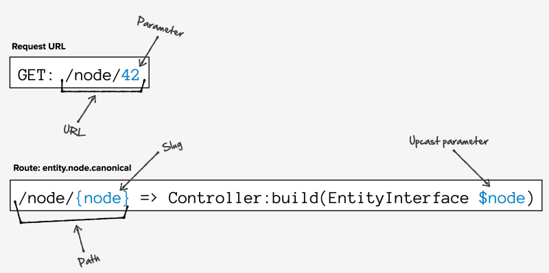

# Overview: Routes, Controllers, and Responsesfree

## Content

Do you know some PHP and want to learn how to create a custom page at a custom URL in Drupal? You're in the right place.

Every web framework has the same job: provide a way for developers to map user-accessible URLs with code that builds the page. *Routes*, *controllers*, and *responses* are what module developers use to create pages at custom URLs in a Drupal site.

In this tutorial, we'll:

- Define what routes, controllers, and responses are.
- Explain the routing workflow that Drupal uses to match a URL to a route.
- Define routing system-related terms like *parameter* and *upcasting*.

By the end of this tutorial, you should be able to explain how a developer uses routes, controllers, and responses to create custom pages in a module.

## Goal

Be able to confidently work through hands-on tutorials and documentation on creating a route with a controller in Drupal because you understand the underlying concepts and terminology.

## Prerequisites

- [5.1. Concept: Paths, Aliases, and URLs](https://drupalize.me/tutorial/user-guide/content-paths)

## Video: Routes, Controllers, and Responses

Sprout Video

## What are routes, controllers, and responses?

Image

Drupal's routing system is built on top of [Symfony's routing system](https://symfony.com/doc/current/routing.html). It can do everything the Symfony system can do and more. If you're already familiar with the Symfony routing system, you should be able to get started with Drupal's pretty quickly. If you've never used the Symfony system, that's okay. You can learn everything you need to know about Drupal's routing system without first learning Symfony.

Some of the features that Drupal's routing system adds to what Symfony already provides include *access checking* and *parameter upcasting*. We'll explain what these terms mean in a moment.

### Routes

Routes are the configuration that declare the existence of a path (or URL) and tell the system which code to call to generate the content for that path. Routes can also provide configuration for access control and how to handle passing parameters from the path to the controller.

In Drupal, route definitions typically live in a *{MODULE\_NAME}.routing.yml* file, in the root directory of the module. Routes can also be defined dynamically via a route definition callback.

When a user visits the path `/node/42`, the route, `entity.node.canonical`, defines what code should be executed, whether the current user should be able to access the content, and if there are any arguments that need to be provided to the code.

Image

Routes are not URLs. A route is a named definition that maps to a specific set of instructions for generating a page's content. While a URL (Uniform Resource Locator) is the complete web address that users enter into their browsers to access a specific page or resource. The route's path is a crucial part of the URL that Drupal uses to determine how to handle the request and display the content. URLs can change. Different URLs can point to the same route, while routes remain canonical. Consider, for example, that with URL aliases enabled, both `/node/42`, and `/blog/2023-04/routes-rule` could point to the same route and display the same node. And that a single route like `entity.node.canonical` could display a different node depending on the parameters that are passed to the route. That's why it's common to use the route to generate the link instead of the URL, when writing code that will output a link. Learn more in [Generate URLs and Output Links](https://drupalize.me/tutorial/generate-urls-and-output-links).

### Route terms to know: slug, parameter, and upcasting

The path of a route can contain a *slug*. These act like wildcards in the URL and allow a single route to serve multiple unique URLs. The path for accessing a node looks like `/node/42` or `/node/31337`, where the number at the end of the path is the unique ID of the node. Rather than define a route for every single node, the path component of the route uses a curly-braces-wrapped slug, for example, `/node/{node}`. The value of the slug is passed as a *parameter* to the controller, as in `MyController::build($node)`.

Drupal uses a pattern called parameter *upcasting* to allow a route to say, "That number is actually a node ID, and instead of passing the integer value to the controller, why don't you go ahead and load the `$node` object from the database and pass that to the controller instead?" Thus, because of the route's use of a *slug* in its path definition, the number `42` (from the path `/node/42`) is *upcast* to a `$node` object for node ID: 42, and the controller specified in the route definition **now has access to the fully loaded node object**.

Learn more in [Overview: Parameters and Value Upcasting in Routes](https://drupalize.me/tutorial/overview-parameters-and-value-upcasting-routes).

### Controllers

But, what is a "controller"?

*Controllers* are PHP classes that serve as the callback for a route. When a route is matched to a request, the corresponding controller is executed and is responsible for generating the content for the page. This can involve querying a database, processing data, performing calculations, and preparing the necessary information to be displayed. In Drupal, controllers collect and process data. But, controllers in Drupal stop short of determining how to display the data, and instead return a *response*.

### Responses

After the controller has executed its logic, it generates a *response*. Think of this as the primary content you want displayed at the path provided by the route. This might be some HTML content or an HTTP status code or a JSON object. Whatever the case, the result is a Symfony `Response` object which contains the information the system needs to render the page in the user's browser.

In Drupal, a controller's return value is typically a [renderable array](https://drupalize.me/tutorial/what-are-render-arrays), a hierarchical associative array that represents the content to display on the page. Drupal will take the render array and convert it to a Symfony `Response` object. Alternatively, a controller can return a `Response` object directly. This is useful if you need to return an HTTP status code or non-HTML content (such as a JSON object) for a route.

## Putting it all together: route, controller, and response

*Routes* map paths to *controllers* which return *responses*. At a high level, when Drupal process a request for a URL from a user's browser, it looks like this:

1. Convert the incoming HTTP request into a `Request` object.
2. Figure out which route to use via a best-fit matching algorithm.
3. Enhance the `Request` object based on the route definition (authentication, variables in path, etc.).
4. Execute the code in the controller defined by the route which returns a `Response`.
5. If needed, use the theme layer to render the `Response` as HTML.
6. Send the HTML/HTTP to the requesting user.

The rest of this tutorial contains a detailed explanation of how routing works. **You do not need to know the following details in order to create a new route and controller**. You can **stop here** and **skip ahead** to [Create a Route and Controller](https://drupalize.me/tutorial/create-route-and-controller).

## Deep dive: routing in Drupal

Computing routes is slow, so Drupal compiles a list of routes and additional information necessary to process each route, and then **caches** that into the `router` database table. This is done as a compiler pass by the code in `\Drupal\Core\Routing\RouteCompiler`. This results in a bunch of `\Drupal\Core\Routing\CompiledRoute` objects serialized in the database. The route compilation process will also check to see if any of the available parameter converter services (that do the upcasting) apply to the given route. If so, it will add those specific converters to the definition, so that it does not have to perform this lookup each time a route is used.

Example `var_dump` of the route object for `entity.node.canonical`:

Image

---

*Tip:* To view a `var_dump` of route objects on your own site, like in the screenshot above, [download and install](https://drupalize.me/tutorial/user-guide/extend-module-install) the [Devel module](https://www.drupal.org/project/devel). Once installed, *Devel* will be added to the *Manage* administrative menu. Click *Devel* > *Routes info*. For any route, click the *Devel* button (in the **Operations** column), and an interactive `var_dump` of the route object will appear. Within the route detail window, select an arrow to expand and inspect nested arrays or objects.

---

When someone requests a path on your site, it needs to figure out which route to use. This starts with the route provider finding a list of potential routes, then applying route filters to the list. The filters will narrow the list of possible routes by doing things like removing any routes that return JSON when the request is for HTML. Then it'll search the remaining list for a match.

The URL of the request is matched against all the routes still in the list. Once a match is found, parameter values are extracted from the path and the route object gets *enhanced*. Route enhancers are given the chance to modify the route definition taking into account any parameter values. This allows for parameter upcasting before the controller is executed.

Finally, access checking occurs and if the current user does not have access to the route, rather than invoke the controller, Drupal will issue an HTTP 403 response.

If access checking passes after the route has been matched and the parameters converted, and any static parameters from the route's definition have been merged in, the list of parameters is matched against the arguments for the controller method associated with the route. The `ArgumentResolver` from Symfony's `HttpKernel` uses reflection to put the parameters in the correct order before calling the controller to handle the request.

Here is the order of operations the system uses when figuring out which route to use to respond to a request:

1. Get a collection of routes which potentially match the current request. This is done by the route provider. See `\Drupal\Core\Routing\Router::getInitialRouteCollection()`, and `\Drupal\Core\Routing\RouteProvider`.
2. Filter the collection down further. For example, the class, `\Drupal\Core\Routing\Router::applyRouteFilters()`, filters out routes applying to other formats.
3. Find the best matching route out of the remaining ones, by applying a regex. See `\Drupal\Core\Routing\Router::matchCollection()`.
4. Enhance the list of route attributes; for example, loading entity objects. See `\Drupal\Core\Routing\Router::applyRouteEnhancers()`.
5. Perform access checking for the route. See `\Drupal\Core\Routing\AccessAwareRouter::checkAccess`.
6. Dispatch to the controller defined by the route. See `\Drupal\Core\EventSubscriber\EarlyRenderingControllerWrapperSubscriber`.

To learn more about how routing, controllers, and responses fit into the bigger picture of how Drupal process a request, see [How Drupal Turns a Request into a Response](https://drupalize.me/tutorial/how-drupal-turns-request-response).

## Recap

In this tutorial, we learned that routes are configuration that map a path (URL) to a controller, and provide details about who can access the URL and any parameters to pass to the controller. Controllers are PHP classes in a module that generate the content for a page and return it to Drupal as either a renderable array or a Symfony `Response` object.

We learned that Drupal's routing system is built on top of Symfony's and that anything you can with Symfony routing applies to Drupal. We also learned that Drupal provides additional enhancements like access checking and parameter upcasting.

## Further your understanding

- Explain the use case for parameter upcasting.
- Take a look at the `{MODULE_NAME}/{MODULE_NAME}.routing.yml` files Drupal core modules (*core/modules*) to see example route definitions.

## Additional resources

- [How Drupal Turns a Request into a Response](https://drupalize.me/tutorial/how-drupal-turns-request-response) (Drupalize.Me)
- [Routing system overview](https://www.drupal.org/docs/drupal-apis/routing-system/routing-system-overview) (Drupal.org)
- [Symfony Routing component documentation](https://symfony.com/doc/current/routing.html) (symfony.com)

Was this helpful?

Yes

No

Any additional feedback?

Next
[How to Find a Route in Drupal](/tutorial/how-find-route-drupal?p=3134)

Clear History

Ask Drupalize.Me AI

close