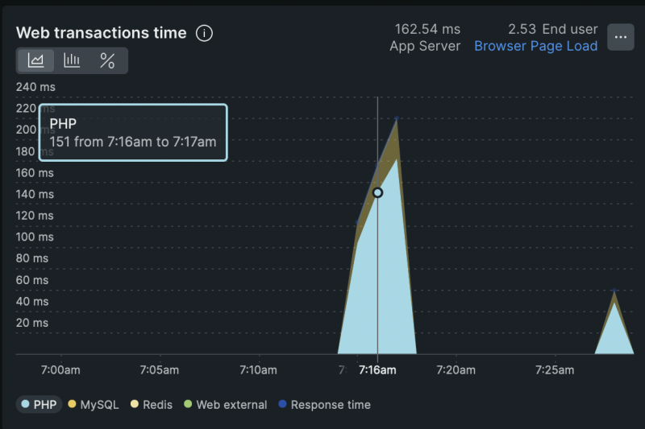
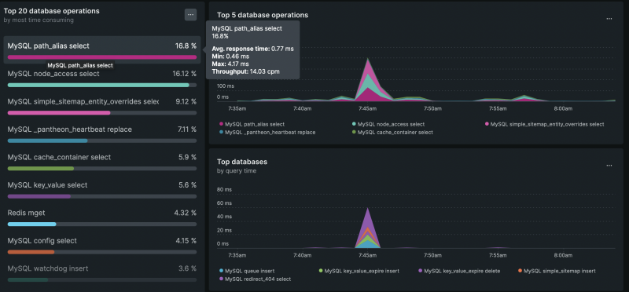

# Profile a Drupal Site with New Relic

## Content

When your site is experiencing performance issues, one way to pinpoint the cause is to use profiling tools. Before you can fix the issue you have to be able to identify what's causing it. All profiling tools do roughly the same thing: they tell you what code is called during the request and how much time is spent executing it. This helps to identify the slowest code and dig deeper into the cause. Once the cause is determined you can start figuring out how to optimize the code.

For this tutorial, we’ll use [New Relic as a profiling tool](https://drupalize.me/tutorial/overview-new-relic-drupal-performance-monitor), but you can apply a similar methodology using the profiling tool of your choice.

In this tutorial, we'll:

- Learn how to identify and analyze slow transactions
- Look at common things to check for while profiling
- Cover some questions you should ask when looking at profiling data to help track down the slow code

By the end of this tutorial, you should know how to profile a Drupal site (specifically with New Relic) to find performance bottlenecks.

## Goal

Find the performance bottlenecks in a Drupal application by using New Relic to profile the code.

## Prerequisites

- [Drupal Performance Profiling: Tools and Methodologies](https://drupalize.me/tutorial/drupal-performance-profiling-tools-and-methodologies)
- [Overview: New Relic as a Drupal Performance Monitor](https://drupalize.me/tutorial/overview-new-relic-drupal-performance-monitor)

## What we are looking for

Using New Relic (or any other tool), our goal is to monitor the PHP code execution and the MySQL database queries that are made in the process of responding to a request for a page.

Getting a full trace of the PHP callstack with execution time can tell us how much time is spent in each function. The MySQL query log tells us what queries are run and how long each one takes.

We can then examine these measurements and look for outliers: either functions or queries that take a long time to run, so we can optimize them; or ones that are called repeatedly and could be sped up by adding caching.

## Steps to profile your Drupal site

This all assumes you're logged in to your New Relic account.

### Review web transactions time and its components

After you log in, you should land on the APM dashboard. In the top left corner of the dashboard, you should see the web transactions time report. This report shows the time it takes for your application to perform a particular transaction, which in most cases is generating a page for a visitor. It also breaks out specific components of the transaction by services. For a Drupal site, you'll see at least 2 services, PHP and MySQL. In our case, the application is behind a Redis cache, so we also see the Redis service. Your report might include other third-party service calls if you use any external APIs.

Image

Based on this graph, we can see which service takes the longest time to respond. In our case, we see that PHP is taking much longer than MySQL. This indicates we can focus on code optimizations since the MySQL layer seems slim. You may want to look into query optimization if you have a bulky MySQL layer.

This is an aggregate for all transactions. But, it's likely some pages are quicker than others and we need to dig in to figure out what the outliers are.

### Analyze the particular transactions

After you gain an overview of the performance profile of your application, you can dive deeper into the particular transactions. Scroll to the bottom of the New Relic dashboard to see the transactions view. At a glance, it shows the slowest transactions ordered from slowest to fastest.

Image

In this example, the slowest transactions seem to be the Drupal 404 controller. Press on the link of your slowest transaction to see a detailed breakdown of it.

Image

Hover over the graph, and you can see the caller that takes the most time to execute. In our case, it’s *\Drupal\system\Controller\Http4xxController* Drupal core controller and its `on404` method. This example is somewhat contrived because Drupal's 404 controller is already pretty fast, but it illustrates how we go about finding slow code.

Look inside the method and see if there are any non-optimal parts of code; look for repeated query calls, big loops, recursion, and multi-branch conditional statements.

Try simplifying the code and minimizing the number of operations and calls each method makes.

Try to use strictly typed variables and strict conditions in the conditional statements. Read PHP documentation and choose array methods with minor performance hits when possible.

On this particular site, we are using a custom 404 page and not a fast 404 response which explains the results.

If your transaction takes more than 2 seconds (default threshold), you can see the transaction trace and understand where it was called from and what actions a user performed that resulted in a slow transaction.

### Analyze Database operations

To understand which Database operations take the longest, navigate to the *Databases* menu item in the left sidebar.

Image

Here you can see the top 20 most time-consuming operations. In this example, it’s `MySQL path_alias select`. Press on the operation to see its detailed breakdown, including its top callers. We can see that the 404 controller is one of the slowest callers.

Image

If you select it, it will return you to the slowest transaction we analyzed. This way, you can connect database operations with the PHP caller.

Look for opportunities to optimize queries by adding indexes to tables. Look for places where the same query is being executed multiple times and is a good candidate for either in-memory or static caching to reduce duplicate calls.

## Use a local benchmarking tool for further development

Once you've identified where slowdowns are happening, consider using benchmarking tools like `ab` to aid in further debugging on your local environment and in developing a fix. Learn more about this in [Profile a Drupal Site with Apache Bench](https://drupalize.me/tutorial/profile-drupal-site-apache-bench).

## Recap

In a nutshell, profiling is identifying the slowest transactions and digging through their details to see which class and method produced the outcome. You need to look at the code, and database queries, and optimize them to minimize execution time. After optimizations, you should rerun the tests to confirm the performance improvement.

It’s important to profile on your server environment and not on your local server, since server configuration may differ from your local environment, and profiling may produce inconsistent results.

## Further your understanding

- Read through PHP documentation, and identify the slowest array methods. Are you using any of them in your code?
- Read through MySQL documentation; what contributes to the slow queries?

## Additional resources

- [New Relic](https://newrelic.com) (newrelic.com)
- [MySQL query optimization](https://www.cloudways.com/blog/mysql-performance-tuning/) (cloudways.com)
- [PHP code optimization](https://www.cloudways.com/blog/php-performance/) (cloudways.com)

Was this helpful?

Yes

No

Any additional feedback?

Previous
[Overview: New Relic as a Drupal Performance Monitor](/tutorial/overview-new-relic-drupal-performance-monitor?p=3091)

Clear History

Ask Drupalize.Me AI

close