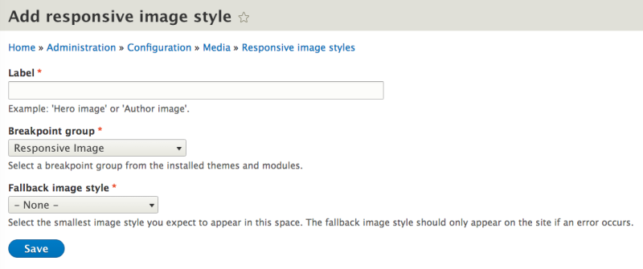

# Responsive Image Module Overview

## Content

The Responsive Image module provides a process for transforming images uploaded through image fields into responsive images. This is accomplished through the configuration of responsive image styles. The configuration form for adding and editing responsive image styles is quite extensive. In this tutorial, we'll go through this form and learn what each option entails. By the end of this lesson, you should have a good understanding of the various options in the responsive image style configuration form.

## Goal

Understand what responsive image styles are, as provided by the Responsive Images module in Drupal, and what to expect from the configuration process.

## Prerequisites

- While no prerequisites are required to understand the responsive image styles configuration form, to actually use it effectively, you will need to have [image styles](https://drupalize.me/videos/spotlight-image-styles) created for each breakpoint.
- Breakpoints and Media Queries. You will need to have a basic understanding of breakpoints and media queries. See [Breakpoints and Media Queries](https://drupalize.me/tutorial/breakpoints-and-media-queries) to brush up on this terminology and learn how these concepts are used in Drupal.
- Regarding breakpoint files, as you will learn in [Responsive Image Style Use Cases](https://drupalize.me/tutorial/responsive-image-style-use-cases), you can use the Responsive Image module's breakpoint file. If you decide to create your own breakpoint file to configure a responsive image style, see these tutorials: [What Is a Breakpoints YAML file?](https://drupalize.me/tutorial/what-breakpoint-yaml-file) and [Create a Breakpoint YAML File](https://drupalize.me/tutorial/create-breakpoint-yaml-file).
- Responsive images. The more you understand about responsive images in HTML, the easier it will be to understand the configuration. But a thorough knowledge of responsive images is not necessarily required. There will be some additional resources at the end of this tutorial to help you further understand this topic.

## Watch: An overview of Drupal's Responsive Image module

Sprout Video

### Related tutorials mentioned in the video

- [Responsive Image Style Use Cases](https://drupalize.me/tutorial/responsive-image-style-use-cases)
- [Create a Responsive Image Style for Viewport-Sizing](https://drupalize.me/tutorial/create-responsive-image-style-viewport-sizing).

## Installation

To install Responsive Image module, using the *Manage* administrative menu, navigate to *Extend*, and in the *Core* section, check **Responsive Image**, and then click the **Install** button at the bottom of the page.

## Permissions

First off, you should be aware of the one permission provided by this module: permission to *administer responsive image styles*. If you need to, ensure that this permission is checked for appropriate site administration or site builder related roles. This permission grants access to add and edit responsive image styles.

Image

## Configuration: responsive image styles

**Responsive image styles** are a map of *breakpoints* and *image styles* that allow you to provide responsive, more appropriate image sources for images uploaded to your site through the Field UI, i.e. images uploaded through an image field on the article content type.

Using the *Manage* administrative menu, navigate to *Configuration* > *Media* > *Responsive image styles* (*admin/config/media/responsive-image-style*) and click **Add responsive image style** to follow along.

Image

### Label

The label will help you identify this responsive image style when you use it in various contexts, such as when you manage display of an image field or configure a view. The machine name will be derived from the label. If you need a custom machine name, you can edit it right after the machine name is initially set, after you fill in the label field. Click the edit link next to the machine name to do so. You will not be able to edit the machine name after you click save on the responsive image style form.

The label field is required.

### Breakpoint group

Each responsive image style that you create will be associated with a breakpoint group. Breakpoint group names can be the name of the theme or module, which is the default when a breakpoint group key is not explicitly defined. Breakpoint group keys are not necessarily exclusive to one theme or module. A breakpoint group key can be used in more than one theme's or module's *.breakpoint.yml file*. See [What Is a Breakpoint YAML File?](https://drupalize.me/tutorial/what-breakpoint-yaml-file) for further explanation.

So while you can only select one breakpoint group for a responsive image style, that breakpoint group could possibly be used in more than one theme or module, and thus your responsive image style could be utilized in more than one theme or module.

To do **viewport sizing** only—that is, to have images scale and stretch to fit a device screen or *viewport*, the breakpoint group needs a single breakpoint with an empty media query. (You can use Responsive Image module's breakpoint configuration for this use case.)

If you want to change the orientation, crop, or aspect ratio of an image (as in **art direction**), the breakpoint group should contain multiple breakpoints. Each of these breakpoints will be listed after you save the form with your label, breakpoint group, and fallback image style choices. You will then select the image style and other optional sizing rules for each breakpoint.

The breakpoint group selection is required. When you select a breakpoint group, a fieldset for each breakpoint will display.

Image

### Fallback image style

The fallback image will be used if the user's browser has a problem providing one of the configured images. It should be the smallest image you expect to fill this image space.

The fallback image style is required.

Image

### Breakpoint settings

After you've filled in Label, Breakpoint group, and Fallback image style, you will be presented with a set of settings for each breakpoint defined in your selected breakpoint group. Each breakpoint group has its own set of configuration, but defaults to **Do not use this breakpoint.** Expand the breakpoint group fieldset to select the type of configuration you want to do.

Image

#### Type

For each breakpoint, you will need to select a *type*.

This section of the form is dynamic, meaning, what you select under **Type** will determine which options are available after that. Even if you select the first option, checking boxes for image styles and then change your type selection, which hides the checkboxes that you just selected, you can go back to type and re-select the first options and your checkbox selections will be retained. However, if you change the breakpoint group, your selections will be completely reset.

Image

The type partially determines which HTML elements and attributes will be used in the final output. To learn more about these type selections, their use cases, and the HTML output, see [Responsive Image Style Use Cases](https://drupalize.me/tutorial/responsive-image-style-use-cases).

- Select multiple image styles and use the sizes attribute.
- Select a single image style.
- Do not use this breakpoint.

First, decide whether or not you will use this breakpoint. If you do not want to use it, keep the default, **Do not use this breakpoint.**

Second, you will need to decide whether or not you need the `sizes` attribute. The `sizes` attribute enables you to provide more information to the browser about which image to use.

If you decide to use this breakpoint and assign one image style to it without using the `sizes` attribute, then you would select the option, **Select a single image style.** You might want to do this if you are only concerned about display-density and want to indicate a 1x, 1.5x, and 2x image style for each breakpoint multiplier. Again, see [Responsive Image Style Use Cases](https://drupalize.me/tutorial/responsive-image-style-use-cases) for more information about that use case.

#### Sizes

Value: A comma-separated list of media conditions (in parentheses) followed by a length value of the image element. Length value can be any absolute or relative unit or the CSS calc() function. The last value is the default length, when no media query applies.

Use the `sizes` attribute to give the browser suggestions as to which size image to use under certain media conditions. The sizes you suggest here should correspond to your image style selections, with the addition of 1.5x and 2x image sizes. See [Responsive Image Style Use Cases](https://drupalize.me/tutorial/responsive-image-style-use-cases) for examples.

The sizes field on this form will be displayed if you have selected the first option from the "Type" section above: "Select multiple image styles and use the sizes attribute."

The `sizes` attribute enables you to pair *media conditions* with image sizes, and provide an image for the smallest viewport size.

Media conditions are abbreviated logical expressions. For example "(min-width: 40em) 40vw, 90vw" could be read as: "If the viewport width is at least 40em, then display the image at 40% of the viewport width, otherwise display the image at 90% of the viewport width." The "vw" CSS length unit is a relative unit and is equal to 1% of the viewport's width.

If you use the `sizes` attribute, you must select at least one image style, which populates the `srcset` attribute. According to the HTML5 specification on ``, sizes will be ignored without `srcset`. See also [this MDN reference page on ``](https://developer.mozilla.org/en-US/docs/Web/HTML/Element/img). (See the description for "sizes".)

#### Image styles

You will need to create appropriate image styles before you create a responsive image style. Image styles are configured at Configuration > Media > Image styles.

Select at least one image style for this breakpoint to use. A number of image styles are provided by Drupal core, but you should create your own appropriately sized, cropped, or scaled image styles that are appropriate for your breakpoints and approach to responsive images for your site's design. For more details about this process, see [Create a Responsive Image Style for Viewport-Sizing](https://drupalize.me/tutorial/create-responsive-image-style-viewport-sizing).

Each image style you select will populate the `srcset` attribute and contain width (`w`) descriptors. (For more information about the HTML output by responsive image styles, see [Responsive Image Style Use Cases](https://drupalize.me/tutorial/responsive-image-style-use-cases)).

The number of image styles you can select depends on what you chose for **Type**.

Once you have configured options for each of your breakpoints, don't forget to save the form.

## Recap

In this tutorial, we walked through the configuration form for responsive image styles provided by Drupal's Responsive Images module. Explore [Responsive Image Style Use Cases](https://drupalize.me/tutorial/responsive-image-style-use-cases) and how to [Create a Responsive Image Style for Viewport-Sizing](https://drupalize.me/tutorial/create-responsive-image-style-viewport-sizing) as your next steps.

## Further your understanding

- Are you new to responsive images or need to brush up? Jason Grigsby from CloudFour has an excellent series of articles on the topic: [Responsive Images 101 series](https://cloudfour.com/thinks/responsive-images-101-definitions/).
- Learn how to use the responsive image style configuration form to solve for common responsive image use cases in this follow-up tutorial: [Responsive Image Style Use Cases](https://drupalize.me/tutorial/responsive-image-style-use-cases) (Drupalize.Me)
- Walk-through the process of creating a viewport-sizing responsive image style in our tutorial, [Create a Responsive Image Style for Viewport-Sizing](https://drupalize.me/tutorial/create-responsive-image-style-viewport-sizing).

## Additional resources

- [Breakpoints and Media Queries](https://drupalize.me/tutorial/breakpoints-and-media-queries) (Drupalize.Me)
- [What Is a Breakpoint YAML File?](https://drupalize.me/tutorial/what-breakpoint-yaml-file) (Drupalize.Me)
- [Create a Breakpoint YAML File](https://drupalize.me/tutorial/create-breakpoint-yaml-file) (Drupalize.Me)
- [Responsive Image Style Use Cases](https://drupalize.me/tutorial/responsive-image-style-use-cases) (Drupalize.Me)
- [Responsive Images 101 series](https://cloudfour.com/thinks/responsive-images-101-definitions/)
- [Picturefill: A Responsive Image Polyfill](https://scottjehl.github.io/picturefill/) (scottjehl.github.io)
- [CSS Lengths](https://www.w3.org/TR/css3-values/#lengths) (W3C)
- [Image Styles](https://drupalize.me/series/image-styles) (Drupalize.Me)
- [Can I Use: Picture Element—browser support for `<picture>` element](https://caniuse.com/picture) (caniuse.com)
- [MDN:  HTML Element](https://developer.mozilla.org/en-US/docs/Web/HTML/Element/img) (MDN)

Was this helpful?

Yes

No

Any additional feedback?

Next
[Responsive Image Style Use Cases](/tutorial/responsive-image-style-use-cases?p=2864)

Clear History

Ask Drupalize.Me AI

close