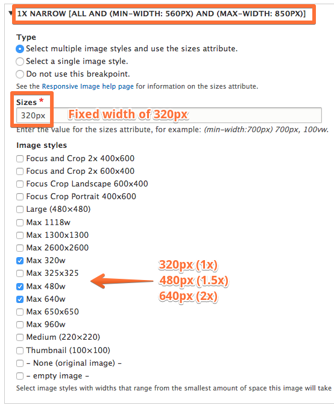
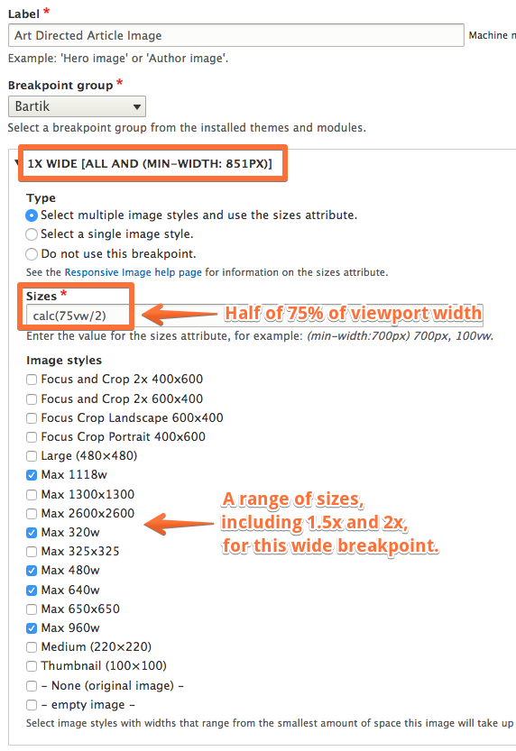

# Responsive Image Style Use Cases

## Content

You might already be familiar with [image styles](https://drupalize.me/videos/spotlight-image-styles) in Drupal. Image styles are a popular and commonly used feature of Drupal because they enable your site's content creators to upload an image once, but have it displayed at various sizes and resolutions depending on its context. Image styles are configured and then applied to an image field's display settings, whether using view modes, Views field settings, or other contexts. Responsive image style field formatters are applied in the same exact way, but the process of creating responsive image styles is a bit different.

Using responsive image styles as image field formatters enables your Drupal site to produce specific HTML markup for images so that either:

1. The browser can choose an appropriately sized image source, given the size of the user device's viewport size
2. You can dictate to the browser which image sources to use at different breakpoints.

In the first case, the resulting markup uses the `srcset` and `sizes` attribute in an `` element. In the second case, `<picture>` and `<source>` elements are generated in conjunction with the `` tag.

It is also possible to create a responsive image style that just provides alternate images depending on the display-density (i.e. 1.5x or 2x) of the user device.

In this tutorial, we'll look at three use cases for responsive images, how those use cases are handled in HTML, and how they can be handled using Drupal's Responsive Image module. By the end of this tutorial, you should be ready to create a responsive image style appropriate for your Drupal site.

## Goal

Understand the overall process of creating a responsive image style in Drupal that addresses various responsive image use cases.

## Prerequisites

- Image styles. This tutorial assumes that you know how to configure [image styles](https://drupalize.me/videos/spotlight-image-styles) in Drupal.
- Responsive images. The more you understand about responsive images in HTML, the easier it will be to understand the configuration. But a thorough knowledge of responsive images is not necessarily required. There will be some additional resources at the end of this tutorial that can further your understanding of this topic.

## What are responsive images?

While CSS can provide solutions for fluid images that flex with their container, HTML now accommodates methods for providing the browser with multiple sources for an image. Which image is displayed depends on the user device's display density, size of the image element in relation to the size of the viewport, and many other environmental conditions. To learn more about responsive images, we recommend this series of articles by Jason Grigsby from CloudFour, starting with [Responsive Images 101: Definitions](https://cloudfour.com/thinks/responsive-images-101-definitions/).

## Responsive images use cases

While there are a handful of responsive image use cases, we're going to look at these common ones:

- Viewport sizing: providing different sizes of the same image based on the size of the viewport, but without changing aspect ratio, orientation, cropping, or content
- Art direction: providing different image sources that may have alternate content or a different aspect ratio or orientation
- Display-density: providing 1.5x or 2x images for higher display-density user devices.

In the case of viewport-sizing, we're going to provide the browser with a number of image choices, which we'll provide by creating a series of standard image styles. The key here is that the *browser chooses* which image source best fits, given the information we provide. We'll populate the sizes attribute field and choose the image styles that the browser should choose from. The resulting markup will be an `` element with a `srcset` attribute containing image sources and associated width (`w`) descriptors, and a `sizes` attribute.

In the case of art direction, we can dictate to the browser which image source to use under different media conditions. These sources can be totally different images, perhaps cropped or re-composed, or have a different aspect ratio or orientation.

Finally, we'll look at how to provide display-density (i.e. 1.5x and 2x images) image suggestions to the browser. But, as you'll see, providing 1.5x and 2x images can also be rolled into the previously-mentioned use cases. But if all you care about is display-density descriptors, we'll show you how to accomplish that with responsive image styles.

## Use case: viewport-sizing responsive images

### Objective

You want to provide different sizes of an image without altering the content, aspect ratio, or orientation. Works well if you already have flexible images using CSS and you want to improve site performance and user experience by providing more appropriately-sized images in relation to the user device's viewport.

### Markup approach

- Use `srcset` and `sizes` attributes on the `` element.

### Explanation of markup

- **`srcset`**: provides a comma-separated list of image source suggestions followed by a width (`w`) descriptor
- **width descriptor (`w`)**: Used in the `srcset` attribute to tell the browser the width of each image source. For an image that is 325px wide by 325 pixels high, the width (`w`) descriptor would be `325w`.
- **`sizes`**: Required when `srcset` width descriptors are used. Tells the browser the size of the `` element in relation to the *viewport*, and how that relationship changes under certain media conditions. Value: A comma-separated list of media conditions (in parentheses) followed by a length value of the image element. The last item in the list must not contain a media condition. Length value can be any absolute or relative unit or the CSS calc() function. The last value is the default length, when no media query applies.
- **`src`:** The `src` attribute on the `` element contains the fallback image source and should be the smallest image source that you expect to appear in this element.

### References

- [Responsive Images 101, Part 4: Srcset Width Descriptors](https://cloudfour.com/thinks/responsive-images-101-part-4-srcset-width-descriptors/)
- [Responsive Images 101, Part 5: Sizes](https://cloudfour.com/thinks/responsive-images-101-part-5-sizes/)

### Example breakpoint configuration file

This is an example of a breakpoint configuration file that you could use to solve for the viewport-sizing use case. In fact, you can use the Responsive Image breakpoint group, regardless of your theme. (You do not have to replicate this breakpoint file in your theme.)

*core/modules/responsive\_image/responsive\_image.breakpoints.yml*

**Breakpoint group**: Responsive Image

```
responsive_image.viewport_sizing:
  label: Viewport Sizing
  mediaQuery: ''
  weight: 0
  multipliers:
    - 1x
```

### Responsive image style configuration

This is a high-level overview of the configuration for the viewport-sizing use case. For a more detailed step-by-step tutorial of this process, see [Create a Responsive Image Style for Viewport-Sizing](https://drupalize.me/tutorial/create-responsive-image-style-viewport-sizing).

- Create label
- Select **Responsive Image** breakpoint group, which provides a "Viewport sizing" breakpoint with an empty media query.
- Select option: "Use multiple image styles and the sizes attribute"
- Select image styles that are approximately sized to fill the `` element at each breakpoint. Include 1.5x and 2x sized images for high pixel-density screens. The Responsive Image module will generate the `srcset` attribute value based on your image styles.
- Fill in the `sizes` attribute field with a comma-separated list of media conditions and length values, or `100vw`, if the image will always fill the screen.

Image


### Responsive image style markup output example

```

```

### CSS

Use along with this CSS in your theme to achieve truly flexible responsive images:

```
img {
  width: 100%;
  max-width: 100%;
  height: auto;
}
```

## Use case: art directed images

### Objective:

You want to change the content, aspect ratio, or orientation of your images under certain environmental conditions. Perhaps you want to crop the image, use a different source altogether or change the orientation from landscape to portrait. You are dictating to the browser which sources to use.

### Markup approach

- Use the `<picture>` element.

### Explanation of markup

- The `<picture>` element contains a number of `<source>` elements and a required `` element.
- Each `<source>` element contains a required `srcset` attribute. Additional optional attributes include `media`, `sizes`, and `type`. (The attributes `sizes` and `srcset` work the same here as they do on an `` element.)
- The `media` attribute contains a media query. This should be a full media query, not a media condition that you would use in a `sizes` attribute.
- The source tags will be ordered by media query, from the largest to the smallest viewport size. If none of the media queries apply, then the `` element will be used.

### References

- [Responsive Images 101, Part 6: Picture Element](https://cloudfour.com/thinks/responsive-images-101-part-6-picture-element/)

### Example breakpoint configuration file

This an example breakpoint file that contains multiple breakpoints, some containing media queries. You will need to create a breakpoint configuration file in your theme that matches your design's breakpoints and media queries. To learn more breakpoint files, see [What Is a Breakpoint YAML File?](https://drupalize.me/tutorial/what-breakpoint-yaml-file)

*core/themes/bartik/bartik.breakpoints.yml*

**Breakpoint group**: Bartik

```
bartik.mobile:
  label: mobile
  mediaQuery: ''
  weight: 0
  multipliers:
    - 1x
bartik.narrow:
  label: narrow
  mediaQuery: 'all and (min-width: 560px) and (max-width: 850px)'
  weight: 1
  multipliers:
    - 1x
bartik.wide:
  label: wide
  mediaQuery: 'all and (min-width: 851px)'
  weight: 2
  multipliers:
    - 1x
```

### Responsive image style configuration

- Select label
- Select a breakpoint group with a breakpoints YAML file containing multiple breakpoints (i.e. Bartik)
- For each breakpoint, select Type: "Select multiple styles and use the sizes attribute"
- For each breakpoint, choose the appropriate image styles
- For each breakpoint, populate the `sizes` attribute with the expected size of the `` element in relation to the viewport (can be a single value or comma-separated list of multiple media conditions with lengths)

### Mobile breakpoint configuration example:

Image


### Narrow breakpoint configuration example:

Image



### Wide breakpoint configuration example:

Image



### Responsive image style markup output example

In this example, we translated the viewport-sizing example that uses the Responsive Images breakpoint with an empty media query and the `sizes` attribute into a multiple breakpoint example (using the Bartik breakpoint group). The difference is the value of `sizes` is spread across 3 breakpoints instead of one, resulting in a `<picture>` element instead of `` only.

```
<picture>
  <!-- Wide breakpoint -->
  <source 
    srcset="
    /sites/default/files/styles/max_320w/public/2017-03/2016-10-10%2015.52.29_0.jpg 320w,
    /sites/default/files/styles/max_480w/public/2017-03/2016-10-10%2015.52.29_0.jpg 480w,
    /sites/default/files/styles/max_640w/public/2017-03/2016-10-10%2015.52.29_0.jpg 640w,
    /sites/default/files/styles/max_960w/public/2017-03/2016-10-10%2015.52.29_0.jpg 960w,
    /sites/default/files/styles/max_1118w/public/2017-03/2016-10-10%2015.52.29_0.jpg 1118w
    " 
    media="all and (min-width: 851px)" 
    type="image/jpeg" 
    sizes="
      (max-width: 1290px) calc(75vw/2), 
      (min-width: 1291px) 480px, 
      320px
    "
  >
  <!-- Narrow breakpoint -->
  <source 
    srcset="
      /sites/default/files/styles/max_320w/public/2017-03/2016-10-10%2015.52.29_0.jpg 320w,
      /sites/default/files/styles/max_480w/public/2017-03/2016-10-10%2015.52.29_0.jpg 480w,
      /sites/default/files/styles/max_640w/public/2017-03/2016-10-10%2015.52.29_0.jpg 640w
    " 
    media="all and (min-width: 560px) and (max-width: 850px)" 
    type="image/jpeg" 
    sizes="320px"
  >
  <!-- Mobile breakpoint -->
  <source 
    srcset="
      /sites/default/files/styles/max_320w/public/2017-03/2016-10-10%2015.52.29_0.jpg 320w,
      /sites/default/files/styles/max_480w/public/2017-03/2016-10-10%2015.52.29_0.jpg 480w,
      /sites/default/files/styles/max_640w/public/2017-03/2016-10-10%2015.52.29_0.jpg 640w,
      /sites/default/files/styles/max_960w/public/2017-03/2016-10-10%2015.52.29_0.jpg 960w,
      /sites/default/files/styles/max_1118w/public/2017-03/2016-10-10%2015.52.29_0.jpg 1118w" 
    type="image/jpeg" 
    sizes="100vw">
  <!-- The fallback image: -->
  
</picture>
```

## Resolution multipliers

This is a rare use case, but one that you can accomplish with responsive image styles. In the unlikely case that you only care about providing alternative images to cover 1.5x or 2x display density, and you have fixed-width images, you can use this approach. But if you have flexible images, you'll want to use `srcset` and `width` descriptors by selecting multiple image styles in the responsive image style configuration (see above two examples).

### Objective

You want to provide alternative images for 1.5x and/or 2x pixel-density screens (i.e. retina), and that's all you care about.

### Markup approach

- Use display-density descriptors in the `srcset` attribute of an `` element.

### Explanation of markup

The `srcset` attribute contains a comma-separated list of image sources followed by a display density descriptor (i.e. `2x`). For example:

```

```

### References

- [Responsive Images 101, Part 3: Srcset Display Density](https://cloudfour.com/thinks/responsive-images-101-part-3-srcset-display-density/)

### Breakpoint configuration file example

This is an example of a custom breakpoint file (called *squishy*) that contains 3 breakpoints and 3 multipliers. The list of multipliers indicates which display-densities this breakpoint supports. The Breakpoint module supports 1x, 1.5x, and 2x multipliers.

**Breakpoint group**: Squishy (or name of theme)

```
squishy.mobile:
  label: mobile
  mediaQuery: ''
  weight: 0
  multipliers:
    - 1x
    - 1.5x
    - 2x
squishy.narrow:
  label: narrow
  mediaQuery: 'all and (min-width: 560px) and (max-width: 850px)'
  weight: 1
  multipliers:
    - 1x
    - 1.5x
    - 2x
squishy.wide:
  label: wide
  mediaQuery: 'all and (min-width: 851px)'
  weight: 2
  multipliers:
    - 1x
    - 1.5x
    - 2x
```

### Responsive image style configuration

- Create label
- Select a breakpoint group that contains 1.5x and/or 2x multipliers in its breakpoints configuration file (see example above).
- For each applicable breakpoint + multiplier set, select "Type: Select a single image style".
- Select the image style for each breakpoint + multiplier set.
- You don't have to use every breakpoint + multiplier option. Keep "Do not use this breakpoint" as the default value if you don't want to provide a set of image sources for it.

### Mobile breakpoint multiplier configuration

Image


### Narrow breakpoint multiplier configuration

Image


### Wide breakpoint multiplier configuration

Image


### Responsive image style markup output

In this example, we selected a single image style for each breakpoint + multiplier combination using our Squishy breakpoint configuration file. Each `<source>` element represents a breakpoint, and each item in the `srcset` is the image source followed by the display density descriptor. We selected a single image style for each multiplier for each of the 3 breakpoints we configured in *squishy.breakpoint.yml*. This results in 3 `<source>` elements inside a `<picture>` element and 3 image sources with display-density descriptors in the `<source>` elements `srcset` attribute.

We configured this responsive image style with 1x, 1.5x, and 2x images based on the following sizes:

| Breakpoint | 1x | 1.5x | 2x |
| --- | --- | --- | --- |
| Mobile | 559 | 839 | 1118 |
| Narrow | 320 | 480 | 640 |
| Wide | 320 | 480 | 640 |

```
<picture>
  <!-- Wide breakpoint: 1x, 1.5x, and 2x -->
  <source 
    srcset="
      /sites/default/files/styles/max_320w/public/2017-03/2016-10-10%2015.52.29_0.jpg 1x,
      /sites/default/files/styles/max_480w/public/2017-03/2016-10-10%2015.52.29_0.jpg 1.5x,
      /sites/default/files/styles/max_640w/public/2017-03/2016-10-10%2015.52.29_0.jpg 2x
    " 
    media="all and (min-width: 851px)" 
    type="image/jpeg">
  <!-- Narrow breakpoint: 1x, 1.5x, and 2x -->
  <source 
    srcset="
      /sites/default/files/styles/max_320w/public/2017-03/2016-10-10%2015.52.29_0.jpg 1x,
      /sites/default/files/styles/max_480w/public/2017-03/2016-10-10%2015.52.29_0.jpg 1.5x,
      /sites/default/files/styles/max_480w/public/2017-03/2016-10-10%2015.52.29_0.jpg 2x
    " 
    media="all and (min-width: 560px) and (max-width: 850px)" 
    type="image/jpeg"
  >
  <!-- Mobile breakpoint: 1x, 1.5x, and 2x -->
  <source 
    srcset="
      /sites/default/files/styles/max_559w/public/2017-03/2016-10-10%2015.52.29_0.jpg 1x,
      /sites/default/files/styles/max_839w/public/2017-03/2016-10-10%2015.52.29_0.jpg 1.5x,
      /sites/default/files/styles/max_1118w/public/2017-03/2016-10-10%2015.52.29_0.jpg 2x
    " 
    type="image/jpeg">
  <!-- Fallback image -->
  
</picture>
```

## Cross-browser compatibility note

The Responsive Image module utilizes a JavaScript library called *PictureFill.js* that enables cross-browser compatibility. That being said, the HTML attributes and elements that are generated by the module [already enjoy wide browser support](http://caniuse.com/#feat=picture). With the exception of Internet Explorer 8, the techniques described in this and related tutorials on Drupalize.Me will work well among modern browsers. In the case of IE8, the smallest image will still display in the `` tag as a fallback.

Responsive image module will not always output a `<picture>` element. Using a breakpoint with an empty media query (such as the one provide by Responsive Image module) and selecting the type: "Select multiple image styles and use the sizes attribute" will yield an `` element with `srcset` and `sizes` attributes.

So, when researching browser compatibility, look for support for:

- `<picture>` element
- `srcset` attribute
- `sizes` attribute

Also, check out the [Picturefill](https://scottjehl.github.io/picturefill/) library (used by Responsive Image module) to see how that library bridges the browser compatibility gap.

## Recap

In this tutorial, we'll looked at three use cases for responsive images, how those use cases are handled in HTML, and how they can be handled using Drupal's Responsive Image module. You should now be ready to create a responsive image style appropriate for your Drupal site. Start with [Create a Responsive Image Style for Viewport-Sizing](https://drupalize.me/tutorial/create-responsive-image-style-viewport-sizing), a method that will work for 80% of responsive image use cases.

## Further your understanding

- Identify the different contexts for images on your site such as hero images, slideshows, images in a sidebar, or images in an article. What use cases should apply for each of these contexts?

## Additional resources

- [Create a Responsive Image Style for Viewport-Sizing](https://drupalize.me/tutorial/create-responsive-image-style-viewport-sizing) (Drupalize.Me)
- [Responsive Images 101 series](https://cloudfour.com/thinks/responsive-images-101-definitions/) (CloudFour.com)
- [Breakpoints and Media Queries](https://drupalize.me/tutorial/breakpoints-and-media-queries) (Drupalize.Me)
- [What Is a Breakpoint YAML File?](https://drupalize.me/tutorial/what-breakpoint-yaml-file) (Drupalize.Me)

Was this helpful?

Yes

No

Any additional feedback?

Previous
[Responsive Image Module Overview](/tutorial/responsive-image-module-overview?p=2864)

Next
[Create a Responsive Image Style for Viewport-Sizing](/tutorial/create-responsive-image-style-viewport-sizing?p=2864)

Clear History

Ask Drupalize.Me AI

close