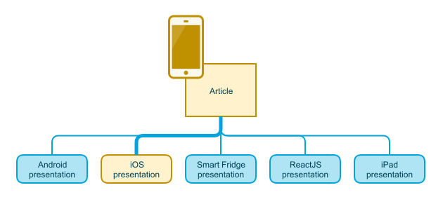

# Separation of Concerns: Content vs. Presentation

## Content

Traditional Drupal development using the [render pipeline](https://drupalize.me/tutorial/render-pipeline) allows you to ignore the pitfalls of mixing content and presentation logic in your data model. In a scenario with multiple distribution channels, this separation becomes of critical importance.

In this tutorial we will learn how to:

- Understand the importance of presentation and content separation (delivering clean content, not caring about how to show that content)
- Develop strategies to avoid these presentational problems with minimal damage to the content API

By the end of this tutorial you'll have a better understanding of why keeping presentation data out of your content model is important, and some tips for doing so.

## Goal

Understand the difference between content and presentation and how that relates to API design.

Sprout Video

## A matter of utmost importance

In a decoupled project the data storage and (probably) editorial tools are kept separate from the application in charge of the user interaction. Decoupled architectures allow us to add new presentations without significant back-end changes -- an important benefit. In fact, having multiple distribution channels is the most common reason to *go decoupled*.

One of the major drawbacks is that by decoupling we weaken the ability of content editors to control how the content will be presented to the user. This is because Drupal is no longer in charge of rendering the information, but only provides a web service. In fact the Drupal application may not even be accessible to non-editors, other than via the API.

As Drupal developers this should be our most important mantra: *Drupal does not serve a particular front-end, it serves many*. Even if that is not true today, we need to act as if it was. We must not allow the designs for that React JS site influence how the content types and fields are created. If we concede, we will be in trouble when the iOS app wants to do the same. The React JS site and the iOS application may not have compatible designs or interactions. Allowing presentational properties to *interfere* with our data model will inevitably lead to:

- Content model bloat.
- Maintainability issues.

## Risks

Imagine a traditional (non-decoupled) Drupal site that has a content type that allows the editor to select where the title of the node should be displayed on the page. We could do that by adding a `field_title_position` that allows the values `top, bottom, left, right, hidden`. When rendering the page for that node, we could read the content of that field and present the node accordingly using Drupal's theme layer.

Now imagine that we keep the same mindset, but this time for a decoupled app backed by Drupal for an Apple TV. In this case the API would introduce a JSON property -`titlePosition`- in the data sent to the tvOS front-end, so the app can read it and then position the title accordingly. It all works. The problem is when you introduce the Roku app. Since all the applications consume the same API, your `titlePosition` in the JSON object says `bottom` for both the tvOS and Roku apps. That puts you in a situation where the backend implementation dictates that all the front-ends have the title in the same position, for that particular article. We agree that site building should make some design options impossible.

We could be tempted to solve that by having different fields `field_title_position_tvos`, `field_title_position_roku`, `field_title_position_angular` and so on. In that case, performance will be impacted due to many extra *presentational* fields. This will have a bigger impact if you do this in many different places. In addition to that, adding a new front-end will imply significant back-end changes. We will need to add many fields to many content types to control the presentation logic.

Image

Another non-ideal solution to avoid, is to keep only one `field_title_position` but have multiple nodes for the same content, one per consumer application. In that scenario we need to do *N* different updates each time we need to edit the content. Moreover we have to start worrying about duplicated content in content lists and other complications.

In general, having your content be aware of the consumers of API will lead to maintainability and scalability issues. This is visible when adding a new consumer is no longer easy for the back end.

## Recommendations

The best solution to this issue is to avoid the problem to start with. Talk to the design team and find a solution together. Ideally you will be able to avoid giving editors the possibility to control how the content is presented. In a decoupled scenario that possibility may lead to trouble.

I am fully aware that avoiding the problem is sometimes not possible. When that happens, there are some content model techniques that will **mitigate** those problems. The main idea is that we add a new entity reference field for each consumer in our article content type. That entity reference points to a new content type called, for instance, `PresentationForAndroidArticles`. Inside of the `PresentationForEmberArticles` (another additional consumer) we add all the presentational fields that editors need to control for articles when presented in the Ember.js front end. After that is done our article content type is clean of presentational fields, except for those entity references. To make the editorial experience seamless we can add the [Inline Entity Form module](https://www.drupal.org/project/inline_entity_form) to create the presentational content from the article form.

Image

This is not an ideal solution, but it's the best we can do when we cannot avoid the problem altogether. With this technique we contain all the presentational fields in a set of separate content types. Some of the problems still exist (adding a new consumer requires back end intervention), but now the responses for the Alexa application will not get bloated with presentational fields for Windows Phone, Facebook App, Slack Chatbot, etc. Each consumer now has to worry about the article node, and the child presentational node associated to the article, for that particular consumer. We will learn that this is not a problem when using JSON:API, GraphQL or similar.

## Recap

This tutorial highlights the importance of keeping presentation and content separate to avoid maintainability and extensibility problems. We learned about the main problem so we can communicate with management and the design teams. The main goal of this tutorial is to provide compelling arguments to convince others to avoid editorial controls over the presentation in the decoupled consumers. Sometimes the feature will be unavoidable; for those occasions we learned about how to structure our content types to silo the presentational properties. That will help mitigate the problem.

This is one of my favorite tutorials in this series -- because it's what I wish I had known when I did my initial decoupled projects.

## Additional resources

- Learn to [create custom content entity types](https://drupalize.me/tutorial/create-custom-content-entity) for your presentational fields.
- Check out the [inline entity form module](https://www.drupal.org/project/inline_entity_form) to improve the editorial experience.

## Further your understanding

- Looking at the content types that already exist on your site, can you identify information in the data model that is for presentation?
- Have you ever worked with an API that contained presentation data in the content model? Did it affect the client application you created? How so?

Was this helpful?

Yes

No

Any additional feedback?

Previous
[What Are Web Services?](/tutorial/what-are-web-services?p=2960)

Next
[Detect Presentation in Your Data Model](/tutorial/detect-presentation-your-data-model?p=2960)

Clear History

Ask Drupalize.Me AI

close