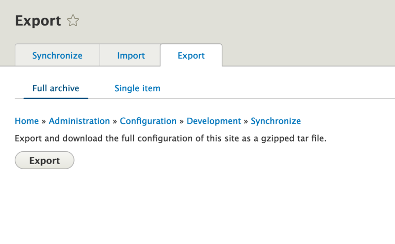

# Set Up Advanced Caching on Pantheon Hosting

## Content

Pantheon uses its *Object Cache* and *Global CDN* services to help improve the performance of your Drupal sites. Using them requires a few steps to enable the services and configure your Drupal site to use them effectively.

Many performance optimizations are hosting-provider-specific. This tutorial covers some Pantheon-specific methods for increasing your Drupal site's performance. It's only relevant if your site is hosted on Pantheon. For other common providers, and generic performance tuning tips, refer to other tutorials in this course.

In this tutorial we'll:

- Learn how to configure and use Pantheon's Object Cache to speed up Drupal caching
- Learn about the use case for Pantheon's Advanced Page Cache module
- Install and configure the Advanced Page Cache module for better Drupal caching of sites hosted on Pantheon

By the end of this tutorial you should be able to explain when and why you would want to use Pantheon's Object Cache and Advanced Page Cache modules, and how they can help speed up Drupal sites hosted on Pantheon.

## Goal

Learn about advanced caching options on Pantheon (Object Cache, Pantheon Global CDN, and Pantheon Advanced Page Cache module) and how to install and use them on the Pantheon platform.

## Prerequisites

- [4.3. Installing a Module](https://drupalize.me/tutorial/user-guide/config-install?p=3069)

## Using Object Cache on Pantheon

Pantheon's *Object Cache* (formerly Redis) is an open source, networked, in-memory, key-value data store based on Redis that can be used as a drop-in caching backend for your Drupal site. At a high level, when using Object Cache and Drupal you can move the `cache_*` database tables that Drupal uses to store cached data into memory where lookups are even faster. Thus, cached data requests can be served faster, and without needing to query the database.

### Enable Object Cache on Pantheon

Enable the **Redis Add On** through the Pantheon dashboard. If your project is under any plan except Basic, it can use the Redis cache add on. In Pantheon's dashboard, go to *Settings* > *Add Ons* and click the *Add* button for Redis. Then wait for the operation to finish.

Image


### Install and configure the Redis module

Download the contributed [Redis module](https://www.drupal.org/project/redis) using Composer, then install the module using Drush or the UI.

If your site utilizes Composer, run the following command from the root of your project:

```
composer require drupal/redis
```

Learn more about [installing modules with Composer](https://drupalize.me/tutorial/user-guide/install-composer?p=3074) and [downloading and installing modules from Drupal.org](https://drupalize.me/tutorial/user-guide/extend-module-install?p=3072).

Install the module in your Drupal site:

Image


Export module configuration through Drush (`drush cex -y`) or through the UI (using the *Manage* administrative menu, navigate to *Configuration* > *Configuration Synchronization* > *Export* (*admin/config/development/configuration/full/export*) and export full archive).

Image



Learn more about [using Drupal's configuration system](https://drupalize.me/topic/manage-and-synchronize-configuration).

### Redis configuration for Pantheon

Edit *sites/default/settings.php* to add the Redis cache configuration. These are mandatory, required Redis configurations for every site:

```
// Configure Redis

if (defined('PANTHEON_ENVIRONMENT')) {
  // Include the Redis services.yml file. Adjust the path if you installed to another subdirectory.
  $settings['container_yamls'][] = 'modules/redis/example.services.yml';

  // phpredis is built into the Pantheon application container.
  $settings['redis.connection']['interface'] = 'PhpRedis';

  // These dynamic variables handled by Pantheon tell Drupal where to find the
  // Redis server.
  $settings['redis.connection']['host'] = $_ENV['CACHE_HOST'];
  $settings['redis.connection']['port'] = $_ENV['CACHE_PORT'];
  $settings['redis.connection']['password'] = $_ENV['CACHE_PASSWORD'];

  $settings['redis_compress_length'] = 100;
  $settings['redis_compress_level'] = 1;

  // Use Redis as the default cache.
  $settings['cache']['default'] = 'cache.backend.redis';
  $settings['cache_prefix']['default'] = 'pantheon-redis';

  // Use the database for caching forms.
  $settings['cache']['bins']['form'] = 'cache.backend.database';
}
```

Then commit the configuration changes and deploy them to Pantheon.

### Verify your Redis installation

After everything is deployed to Pantheon, navigate to the Pantheon dashboard for your site. Select the *Status* section in the left-hand sidebar. Then press the *run checks now* link, and wait for the checks to finish. Scroll to the *Redis* section of the report and verify that *Redis* is enabled and serving data.

Image


## What is Pantheon's Advanced Page Cache module?

[Pantheon provides a Global CDN](https://pantheon.io/features/global-cdn) for all sites hosted on their platform. The Global CDN delivers cacheable assets including content, CSS, and JavaScript from the edge. It's built on top of Fastly CDN and utilizes Fastly's points of presence (POPs) and Google Cloud Platform's comprehensive global data centers.

If you're familiar with the use of Varnish, or another reverse proxy cache, with Drupal the Pantheon Global CDN functions in a similar manner. Requests are passed through the CDN, which passes them on to Drupal, which then stores any cacheable assets in the response at the CDN layer so that the next request can be served without needing to contact Drupal first.

The Pantheon Advanced Page Cache module translates between Drupal's cache metadata and Pantheon's Global CDN and provides granular control over what is cached and for how long. It helps push Drupal's cache metadata to the POPs and control their update cycle.

The module uses surrogate key technology (think of this like *tags* for cached data, so it's easier to identify later) to give your Drupal sites a more accurate cache purge mechanism, and a higher cache hit rate. When your site's data is modified, the module can selectively purge what's needed based on the surrogate keys. This allows administrators to selectively clear only the relevant data from the CDN cache when Drupal content gets updated, ensuring that users get up-to-date content without the need for a full cache expiration.

The Drupal module has no configuration settings. Instead, you can affect the Pantheon Global CDN using Drupal's cache API. The module will translate things like cache tags and contexts for you.

### Install the Pantheon Advanced Page Cache module

We'll download the code for the contributed [Pantheon Advanced Page Cache module](https://www.drupal.org/project/pantheon_advanced_page_cache) using Composer, then install the module using Drush or the *Extend* page.

If your site utilizes Composer, run the following command from the root of your project:

```
composer require  drupal/pantheon_advanced_page_cache
```

### Enable the module

Enable the module either with Drush (`drush en pantheon_advanced_page_cache`) or through the UI.

Image


This module has no configuration settings; enable it, and it'll pass along information already present in Drupal to the Global CDN.

The module only works on the Pantheon platform, and you won't notice any difference in your local environment. After the module is enabled, you need to export the configuration by running the Drush command `drush cex -y` or through the UI (navigate to *Configuration* > *Configuration Synchronization* > *Export* (*admin/config/development/configuration/full/export*) and export full archive).

## Recap

Platforms like Pantheon often provide additional layers of caching, and drop in replacements for Drupal's built-in caching storage. Once enabled and configured, these can help speed up your Drupal site. Pantheon's Object Cache utilizes the Redis framework and stores common cache data in memory instead of the database. Pantheon's Advanced Page Cache module allows tighter integration between Drupal's cache metadata and Pantheon's Global CDN.

If you use Pantheon to host your Drupal application, these services can help improve your site's performance.

## Further your understanding

- Learn more about Drupal's cacheability metadata. Having a firm understanding of the Cache API will help you troubleshoot issues with the Pantheon Global CDN.
- Why is storing cache data in Redis faster? What Drupal data gets stored in Redis?

## Additional resources

- [Drupal cache metadata documentation](https://www.drupal.org/docs/8/api/cache-api/cache-api) (Drupal.org)
- [Pantheon Global CDN](https://pantheon.io/docs/global-cdn) (pantheon.io)
- [Pantheon Object Cache](https://pantheon.io/docs/object-cache) (pantheon.io)
- [Redis official documentation](https://redis.io/) (redis.io)

Was this helpful?

Yes

No

Any additional feedback?

Previous
[Extend Drupal Site Monitoring with Contributed Modules](/tutorial/extend-drupal-site-monitoring-contributed-modules?p=3091)

Next
[Set Up Advanced Caching on Acquia Cloud Hosting](/tutorial/set-advanced-caching-acquia-cloud-hosting?p=3091)

Clear History

Ask Drupalize.Me AI

close