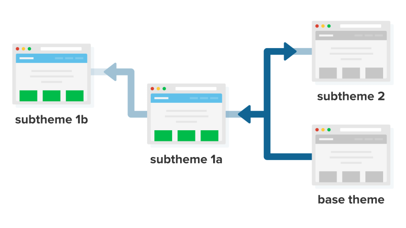

# Theme Inheritance with Base Themes

## Content

Custom themes in Drupal must be configured to inherit settings, templates, and other assets from a parent theme. Which base theme you use is configurable. This allows theme developers to use a different set of markup as the starting point for their theme, organize various theme assets into a more maintainable structure, and more. All of this is made possible because of how Drupal's theme layer uses a chain of inheritance when assembling all the parts of a theme.

Base themes are also a powerful way to encapsulate standards and best practices into a reusable code base. You'll find dozens of contributed base themes on Drupal.org that can serve as a great starting point, especially if you're planning to work with an existing design framework like Bootstrap or Susy Grids. Or if you want to leverage modern JavaScript bundling without setting up Webpack on your own.

In this tutorial we'll:

- Learn what base themes and subthemes are
- Look at a few examples of template inheritance and how that works
- Discuss some use cases for theme inheritance

By the end of this tutorial you'll know how to declare the base theme that your theme builds upon.

## Goal

Explain how theme inheritance works and the role of the `base theme` key in a theme's *\*.info.yml* file.

## Prerequisites

- [Describe Your Theme with an Info File](https://drupalize.me/tutorial/describe-your-theme-info-file)

Sprout Video

**Notes about the video:**

- The `base theme` key is required as of Drupal 9. The video says it's optional and will default to `stable`.
- As of Drupal 9 Bartik is no longer a subtheme of Classy. This is mentioned in the video and there is a diagram that shows this.

## Terminology

Base theme
:   The theme that your theme is extending from. Describes a theme like Classy that is intended to be extended and not just used as-is. Also often referred to as a parent theme.

Subtheme
:   A theme that extends another theme, inheriting all components of the theme being extended. Also often referred to as a child theme.

## Theme inheritance

When creating a theme you must declare a `base theme` key in your *THEMENAME.info.yml* file to let Drupal know where your theme will inherit its template files and other resources from. This can point to one of the base themes in Drupal core, a contributed base theme, or one that you've created yourself.

Image

The chain of inheritance is linear, it can be any length, but each theme can only have a single parent theme. The markup that a user sees when viewing a page is the result of how each of the themes in this chain modifies the markup passed to them by the previous theme with the active theme having the final say.

All themes in Drupal work by overriding the *default* markup that Drupal outputs. Using base themes we have the ability to change the source of that default markup. This is an important part of how [template file inheritance](https://drupalize.me/tutorial/what-are-template-files), a key part of customizing markup in a theme, works.

Theme inheritance opens up a lot of possibilities where base themes can be used as a starting point that bundles up your favorite best practices, common utilities, and CSS/JS libraries into a common codebase. Which can then be shared amongst multiple projects.

Image

## Example use cases for theme inheritance

- The Classy base theme in core provides some sane defaults on top of core's bare minimum markup in order to make it easier to create CSS-only themes.
- Implement a grid system like 960gs as a base theme. Include the baseline CSS and a reset CSS, then use that as a starting point for all new themes.
- [Bootstrap](https://www.drupal.org/project/bootstrap), [Cog](https://www.drupal.org/project/cog), and [Adaptive](https://www.drupal.org/project/adaptivetheme) are all base themes that introduce a new method for handling elements of creating a responsive Drupal theme in a reusable way. Rather then having to implement those methods each time on your own, extend one of these base themes. Many new best practices for theming are implemented between major Drupal versions using contributed base themes such as these.
- Share common design resources between departments at a university, yet allow each department to customize their site. Create a base theme that contains common colors, logos, and a basic layout that works for most situations. Then allow each department to create a subtheme and override the logo for just their department.

## The Stable base theme

While you can inherit the markup output directly from Drupal core (with `base theme: false`) you shouldn't do that. Instead, if you want to start with the most basic markup you should use `base theme: stable` (Drupal 8) or `base theme: stable9` (Drupal 9) in your theme's info file.

In an attempt to allow Drupal core's markup to change throughout its life cycle without potentially breaking your custom theme, Stable was introduced as a base theme. Stable provides a backwards compatibility layer for core's markup, CSS, and JavaScript. You can rely upon Stable as your default base theme without worry that the markup will change on you during a major Drupal version development cycle.

If you're inheriting markup directly from Drupal core (e.g. directly from the template files in the Node module) it's possible that that markup could change between minor versions. Which could have unintended consequences for your theme.

## The Classy base theme

The Classy base theme included in Drupal core also provides markup that you can be assured won't change as well as contextual classes applied to HTML elements that can make it easier to create mostly CSS themes with a minimal amount of changes to the markup.

**Note:** Classy has been deprecated in Drupal 9, and will be moved to a contributed theme in Drupal 10. However, it's still a great starting point for themes and you should feel comfortable choosing it as it'll continue to exist even after it's removed from core. [More info](https://www.drupal.org/node/3103178).

For more about these themes [this article](https://www.lullabot.com/articles/a-tale-of-two-base-themes-in-drupal-8-core) does a good job of explaining the differences between Classy and Stable, and why Stable was created in the first place.

## Contributed base themes

There are a handful of popular contributed base themes, and we recommend looking through all of them before starting your own projects from scratch to at least familiarize yourself with what's available.

Currently the best use cases for contributed base themes are:

- Base themes like [Bootstrap](https://www.drupal.org/project/bootstrap) which implement an existing design framework (<https://getbootstrap.com/>). In this case the design framework has CSS and JavaScript files that you can include and they expect your markup to look a certain way, and to use a defined set of classes. These base themes will do the heavy lifting of converting the majority of Drupal's markup to reflect what the framework expects.
- Base themes like [Cog](https://www.drupal.org/project/cog) which provide a starter kit for common front-end development best practices. For example using Sass to compile your CSS, Bower to manage your JavaScript libraries, and Webpack to bundle it all up. You could achieve all of this on your own, but if someone's already done it for you why not start there?
- Base themes like [Emulsify](https://www.drupal.org/project/emulsify) which attempt to refactor the way that the files in a theme are organized to better reflect a defined architecture and way-of-thinking like the component-driven [Pattern Lab](https://patternlab.io/) project.

You can see the full list of contributed base themes at <https://www.drupal.org/project/project_theme>.

## Recap

In this tutorial we learned that themes in Drupal inherit the markup they are overriding from a base theme. A theme can only have one base theme, but it can have multiple ancestors in the inheritance chain. This allows for themes to be organized into reusable and more maintainable code bases. Base themes are declared in a theme's *THEMENAME.info.yml* file via the `base theme` key.

## Further your understanding

- Draw a diagram that demonstrates the path that a custom theme, which is a subtheme of Classy, traces back to the HTML output from Drupal core.
- What is Stable? And why does it exist?
- Find some commonly used base themes on Drupal.org and explain their use cases and when you might choose to extend them.
- If you've already got a custom theme for your site, are there any benefits you might gain from refactoring it so that some parts of it become a base theme?

## Additional resources

- [Learn how to make your own theme use another theme as a base theme](https://drupalize.me/tutorial/use-base-theme) (Drupalize.Me)
- [Creating a subtheme](https://www.drupal.org/node/2165673) (Drupal.org)
- Learn more about the [Classy base theme](https://www.drupal.org/docs/8/theming-drupal-8/using-classy-as-a-base-theme) (Drupal.org)
- [Drupalize.Me Podcast](https://www.lullabot.com/podcasts/drupalizeme-podcast/what-is-a-base-theme-and-when-should-i-use-one) discussing when/why you should use a base theme (Lullabot.com)

Was this helpful?

Yes

No

Any additional feedback?

Previous
[Describe Your Theme with an Info File](/tutorial/describe-your-theme-info-file?p=3267)

Next
[Drupal Base Themes: Stable and Classy](/tutorial/drupal-base-themes-stable-and-classy?p=3267)

Clear History

Ask Drupalize.Me AI

close