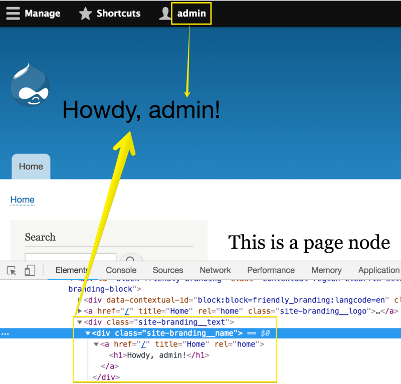

# Use Server-Side Settings with drupalSettings

## Content

It's often useful to pass dynamically calculated values from the server to the client in order to make them available to your front-end JavaScript. Your JavaScript might need to know something particular about the user currently visiting the site or the value of a particular configuration variable. In this tutorial, we'll look at how Drupal can pass these values from the PHP code that executes during a page load to the front-end JavaScript in your theme.

In order to do this, we'll need to:

- Explain how drupalSettings bridges the gap between PHP and JavaScript
- Generate values for settings in PHP and make them available to JavaScript
- Make use of PHP generated settings within your JavaScript code

## Goal

Pass a dynamic value from the server (PHP) to client-side JavaScript using the drupalSettings library.

## Prerequisites

- [What Are Asset Libraries?](https://drupalize.me/tutorial/what-are-asset-libraries)
- [Define an Asset Library](https://drupalize.me/tutorial/define-asset-library)
- [Attach a Library](https://drupalize.me/tutorial/attach-asset-library)
- [Describe Your Theme with an Info File](https://drupalize.me/tutorial/describe-your-theme-info-file)
- [Add Logic with THEMENAME.theme](https://drupalize.me/tutorial/add-logic-themenametheme)
- A custom theme: Use the Drush command `drush generate theme` command to create the theme called `friendly`.

## The drupalSettings library

Drupal core provides a JavaScript library called *drupalSettings*. This library is defined in the *core/core.libraries.yml* file. The particulars of the library are:

```
drupalSettings:
  version: VERSION
  js:
    # Need to specify a negative weight like drupal.js until
    # https://www.drupal.org/node/1945262 is resolved.
    misc/drupalSettingsLoader.js: { weight: -18 }
  drupalSettings:
    # These placeholder values will be set by system_js_settings_alter().
    path:
      baseUrl: null
      scriptPath: null
      pathPrefix: null
      currentPath: null
      currentPathIsAdmin: null
      isFront: null
      currentLanguage: null
    pluralDelimiter: null
```

Taking a look at the relevant portion of the *core/misc/drupalSettingsLoader.js* file we can see that it's an incredibly simple library:

```
/**
  * Variable generated by Drupal with all the configuration created from PHP.
  *
  * @global
  *
  * @type {object}
  */
 window.drupalSettings = {};
```

The drupalSettings library's entire purpose is to provide this `drupalSettings` variable that other modules and themes can use to make variables calculated from PHP available to front-end JavaScript code.

We can give this a try within our custom (*friendly*) theme, by creating a new asset library, which we'll call *friendly-greeting*. First, in the directory for our custom theme we need to define our asset library and declare its dependency on `drupalSettings`. The *friendly.libraries.yml* file will look like this:

```
friendly-greeting:
  version: 1.0
  license: GPL
  js:
    js/friendly-greeting.js: { }
  dependencies:
    - core/drupalSettings
```

As you can see, our new asset library has declared a dependency. The entire library will consist of a single JavaScript file: *friendly-greeting.js*. Next we'll write some PHP to calculate the values we want to pass along to *friendly-greeting.js*.

To demonstrate how we could use `drupalSettings`, in our *friendly.theme* file, let's implement [hook\_page\_attachments\_alter](https://api.drupal.org/api/drupal/core!lib!Drupal!Core!Render!theme.api.php/function/hook_page_attachments_alter/) to add our asset library and our custom variables to the page.

```
/**
* Implements hook_page_attachments_alter().
*/
function friendly_page_attachments_alter(array &$page) {
  // We're going to pass along the user's display name to our front-end code.
  $account = \Drupal::currentUser();
  if ($account->isAuthenticated()) {
    // First we attach our asset library to the page.
    $page['#attached']['library'][] = 'friendly/friendly-greeting';
    // Then we pass along our dynamic value.
    // This will then be available in our JavaScript as drupalSettings.friendly.name.
    $page['#attached']['drupalSettings']['friendly']['name'] = $account->getDisplayName();
  }
}
```

First, our code loads the current Drupal user to check if this request is coming from an authenticated user. If the user is authenticated we attach our *friendly-greeting* asset library to the page. We also attach a variable, the user's display name, to the `drupalSettings` object. The formatting of the `$page[#attached]` array will determine the namespace for our custom variable. In this case `drupalSettings.friendly.name` will be available to the JavaScript file in our asset library.

**Tip**: You can add to the `drupalSettings` variable in any function where you're using the `#attached` Render API element to attach a library. That means this method will work in a [preprocess function](https://drupalize.me/tutorial/what-are-preprocess-functions) as well.

With this code in place, we're ready to make use of our new variable in the JavaScript of our asset library. In our theme, in the *js/friendly-greeting.js* file we now do whatever we need to with the user's display name variable.

```
(function (Drupal, drupalSettings) {
  // If we have a nice user name, let's replace the
  // site name with a greeting.
  if (drupalSettings.friendly.name) {
    var siteName = document.getElementsByClassName('site-branding__name')[0];
    siteName.getElementsByTagName('a')[0].innerHTML = '<h1>Howdy, ' + drupalSettings.friendly.name + '!</h1>';
  }
})(Drupal, drupalSettings);
```

In this case we're first checking to see if `drupalSettings.friendly.name` has been populated properly. If it has we're modifying the site name to include a greeting to the current user visiting the page. Here's a look at the final result (after a [cache-rebuild](https://drupalize.me/tutorial/clear-drupals-cache)).

Image



## Recap

In this tutorial, we learned how to pass along a server-side value to a JavaScript file using the drupalSettings library.

## Further your understanding

- How are core modules and themes making use of `drupalSettings`?
- What other dynamic variables might you want to pass from PHP to JavaScript?
- How might you use `drupalSettings` in another hook or [preprocess function](https://drupalize.me/tutorial/what-are-preprocess-functions) in your `_.theme` file?

## Additional resources

- [JavaScript API overview](https://www.drupal.org/node/2269515) (Drupal.org)

Was this helpful?

Yes

No

Any additional feedback?

Previous
[Wrap Your Custom JavaScript in a Closure](/tutorial/wrap-your-custom-javascript-closure?p=2883)

Next
[String Manipulation in JavaScript](/tutorial/string-manipulation-javascript?p=2883)

Clear History

Ask Drupalize.Me AI

close