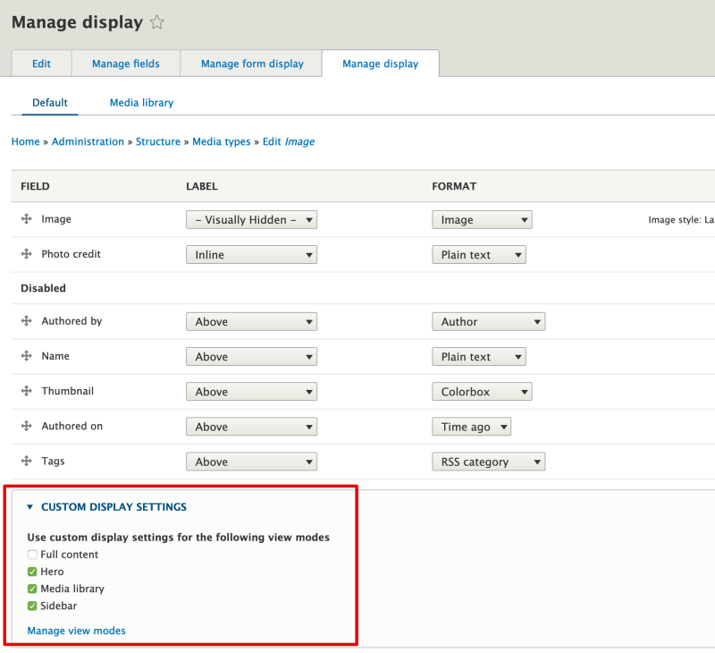
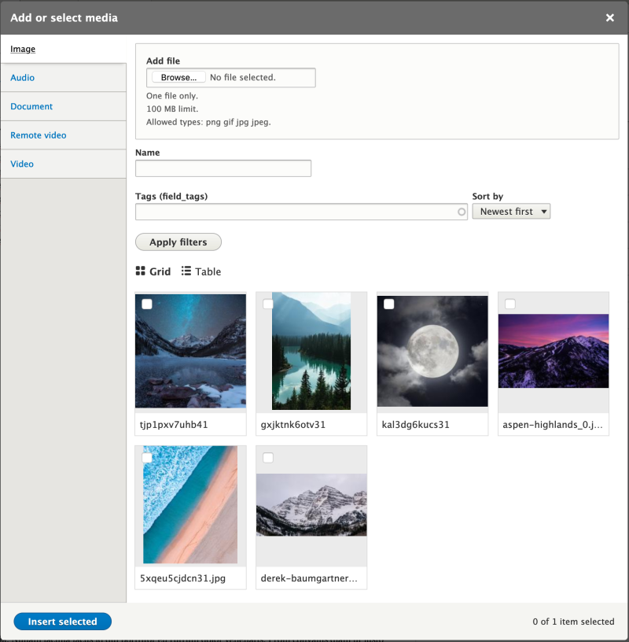
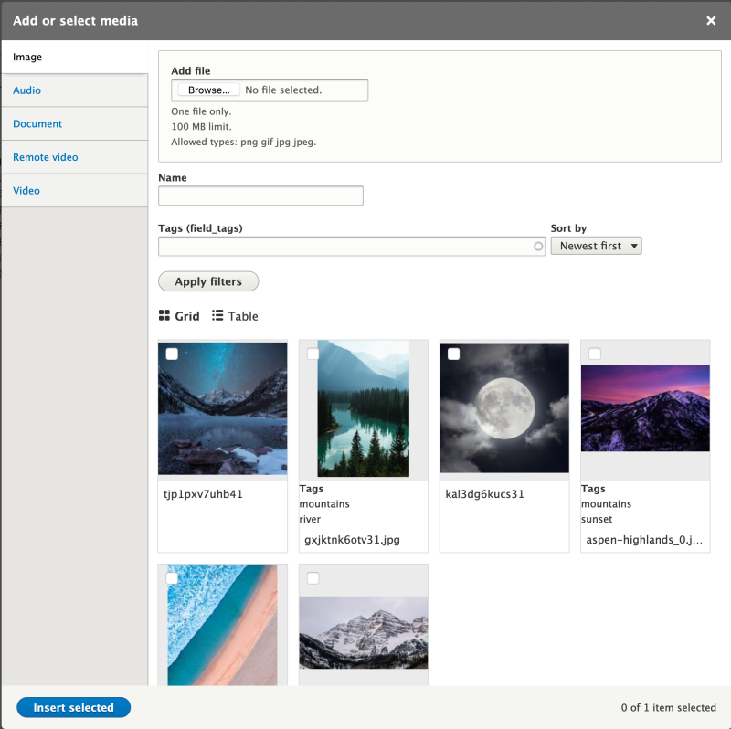

# Use View Modes with Media Entities in Drupal

## Content

Media entities, like any content entity, work great with all the different features Drupal provides for changing the way things are displayed: view modes, Layout Builder, theme templates, and more. We're big fans of using view modes to create a component-like design system where entity types have view modes representing the different context in which they're displayed. Then we theme the view modes. This works great for displaying Media entities associated with a page and for changing the way that Media assets are displayed within the Media Library browser.

In this tutorial we'll:

- Create Hero and Sidebar view modes for Media entities
- Configure the Image Media type to use the new view modes and style each one differently
- Use the new view modes to render Image Media assets within a Layout
- Update the *Media library* view mode that's used by the Media Library browser to display additional information alongside the thumbnails used when selecting Media to attach to a page

By the end of this tutorial you should be able to change the way that Media assets are displayed by using view modes and display formatters in a Drupal site.

## Goal

Change the way that Media entities are displayed both publicly and within the Media Library Browser using view modes.

## Prerequisites

- [Concept: View Modes and Formatters](https://drupalize.me/tutorial/user-guide/structure-view-modes)
- [How to Add Fields to a Media Type in Drupal](https://drupalize.me/tutorial/how-add-fields-media-type-drupal)

## Watch: Use View Modes with Media Entities in Drupal

Sprout Video

## Change the public-facing display of Media entities

In most use-cases, Media entities are embedded into the view of another content entity. For example, a series of images, or a video, embedded into an event page. This is true of both Media entities [added via an entity reference field](https://drupalize.me/tutorial/add-media-field-content-type-drupal), or [inserted into a WYSIWYG field](https://drupalize.me/tutorial/how-add-media-button-wysiwyg-editor-drupal). In both cases you can configure which view mode you want to use when displaying the Media entity.

To change the way a Media entity gets displayed, we can either change the current view mode, or add a new view mode and configure the respective field formatter to use the new view mode.

Consider this somewhat complex scenario. The basic page content type on your site is using the Layout Builder to allow for flexible page layouts. It's configured to allow users to override the layout on a per-page basis. The layout has a couple of sections including a *hero* section across the top, and a *sidebar* that's displayed as a narrow second column alongside the primary page content.

Image


The basic page content type has a Media field so you can associate Media entities with it. Now, depending on which section the Media entity is shown in (*hero* or *sidebar*) we want to change the way it looks. Videos, for example, should show the full video player when placed into the *hero* section, but a thumbnail (which when selected will open a modal window with the player) in the *sidebar* section. Part of the solution to this is creating 2 new view modes and then modifying the configuration of the Remote video Media entity type. Then when an author places a video into a section in the layout they can choose the corresponding view mode and the video will render correctly.

### Assumptions

The rest of this tutorial makes the following assumptions:

The *Media* and *Media Library* modules are installed.

You have the [Colorbox](https://www.drupal.org/project/colorbox) contributed module installed.

```
composer require drupal/colorbox
# Download the required JS library.
drush colorbox:plugin
drush en colorbox
```

You have the core *Responsive Image* module enabled. We'll use the default *Wide* style that it provides.

You're using Layout Builder for the basic page content type, and you've created a layout with a single wide hero region on the top, and a 2-column main content region below. Learn more in [Create a Flexible Layout for a Content Type](https://drupalize.me/tutorial/create-flexible-layout-content-type).

### Create 2 new view modes

In the *Manage* administration menu, navigate to *Structure* > *Display modes* > *View modes* (*admin/structure/display-modes/view*), then press the *Add view mode* button.

On the next page choose *Media*. This is the Entity type this view mode will apply to. Then fill in the resulting form with the value "Sidebar" to give your new View mode a name and press *Save*.

Repeat the process to add a Hero view mode as well. You should now have 2 new View modes in the *Media* section.

### Enable the new view modes

In the *Manage* administration menu, navigate to *Structure* > *Media types*, then choose the *Manage display* operation for the *Image* Media type (*admin/structure/media/manage/image/display*). Open the *Custom display settings* section and check the boxes to enable the Hero and Sidebar view modes.

Image



Then press *Save*. You should see a success message, and the Hero and Sidebar options should now show up in the tabs at the top of the page.

Image


### Configure the Sidebar view mode

Select the *Sidebar* tab to configure the Sidebar view mode. Disable all fields except the *Image* field. Configure the *Image* field to use the Colorbox formatter as follows:

| Field name | Value |
| --- | --- |
| Image style for content | Thumbnail (100x100) |
| Image style for first image in content | Thumbnail (100x100) |
| Image style for Colorbox | None (original image) |
| Gallery (image grouping) | Per post gallery |
| Caption | Automatic |

Image


Then press *Save* to update the view mode.

You can show, hide, and format the fields on this page however you want. What you're doing here is dictating what will be shown when Image media assets are displayed using the Sidebar view mode.

### Configure the Hero view mode

Next, select the *Hero* tab to configure the Hero view mode. Disable all fields except the *Image* field and the *Photo credit* field. Configure the *Image* field to use the Responsive Image formatter as follows:

| Field name | Value |
| --- | --- |
| Image Label | Visually Hidden |
| Image Format | Responsive image |
| Responsive image style | Wide |
| Link image to | Nothing |
| Photo credit Label | Inline |
| Photo credit Format | Plain text |

Example:

Image


Then press *Save* to save your changes.

### Test it out

Update the layout used for pages. Add the *Related media* field to the second column of the content section. When placing the field, you can use the *Rendered entity* formatter and choose the *Sidebar* view mode. This will find any associated Media entities and display them using the view mode we configured above.

Image


Additionally, you can test the *Hero* view mode by overriding the Layout for a page and placing a new block in the *Hero* section. Choose the *Related media* field, set the formatter to *Rendered entity* and the view mode as *Hero*.

Example of image in the *Hero* section of the layout:

Image


**Note**: At the time of writing, there's a caveat to this approach. When using multi-value fields in Layout Builder there's no way to limit the number of items displayed. If your media field has more than 1 image attached they are always all displayed. That's not ideal when displaying a Hero image. There's [a work in progress patch to add the ability to limit the number of items output](https://www.drupal.org/project/drupal/issues/3029830) that's worth testing if you need this functionality now.

## Change the display of Media entities in the Media Library

You can change the way that items appear in the Grid view of the Media Library by making changes to the *Media library* display mode.

### Before

Image



In the *Manage* administration menu, navigate to *Structure* > *Media types* and choose the *Manage display* option for the *Image* Media type (*admin/structure/media/manage/image/display*). Then, in the *Local actions* tabs choose the *Media library* display mode.

Enable the fields you want to display (*Tags*, in our case) and configure the field formatter options. Then press *Save*. The changes will be reflected in the Media Library immediately.

### After

Image



**Tip:** You can improve the display by [creating a sub-theme of the admin theme](https://drupalize.me/tutorial/use-base-theme), and then [overriding the Tags field template](https://drupalize.me/tutorial/override-template-file).

## Recap

In this tutorial we learned how to make changes to Media entity displays. We used 2 new view modes named Hero and Sidebar, and the ability to configure which view mode to use when rendering an entity attached via an entity reference field. This allows us to think about our different use-cases as components, and to create reusable styles for displaying Media assets. We also learned that you can change the way thumbnails appear in the Grid mode of the Media Library browser by making changes to the Media library view mode.

## Further your understanding

- Can you add CSS that applies to images that are displayed using the Hero view mode?
- Can you make this same concept work with Remote video Media entities? Try to display a thumbnail when it's in the sidebar, and the full video when it's in the hero section.

## Additional resources

- [Adding Asset Libraries to Custom Layouts](https://drupalize.me/tutorial/adding-asset-libraries-custom-layouts) (Drupalize.Me)
- [Customizing the Media Library](https://www.drupal.org/docs/core-modules-and-themes/core-modules/media-library-module/customizing-the-media-library) (Drupal.org)
- [Display Modes: View Modes and Form Modes](https://www.drupal.org/docs/drupal-apis/entity-api/display-modes-view-modes-and-form-modes) (Drupal.org)

Was this helpful?

Yes

No

Any additional feedback?

Previous
[Track Media Entity Usage in Drupal](/tutorial/track-media-entity-usage-drupal?p=2672)

Clear History

Ask Drupalize.Me AI

close