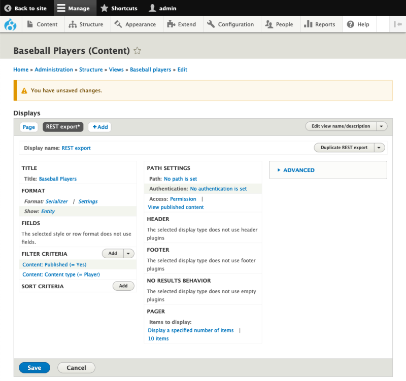
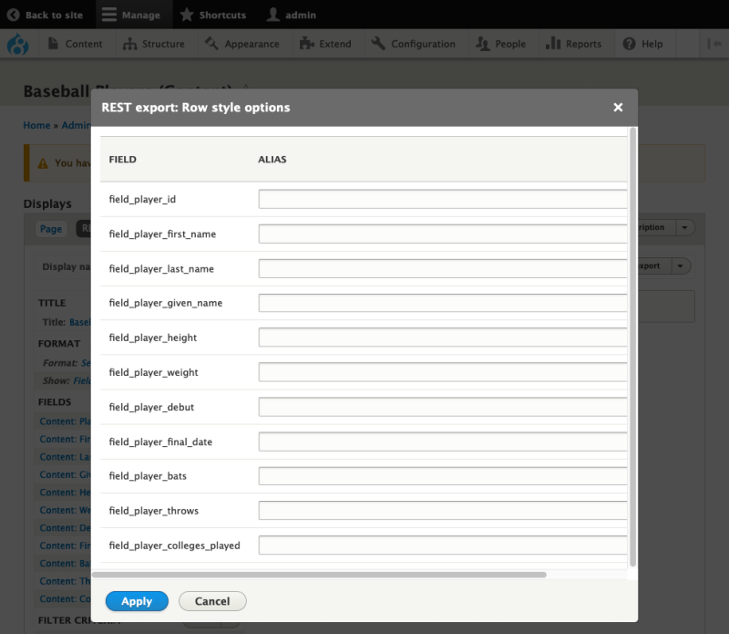
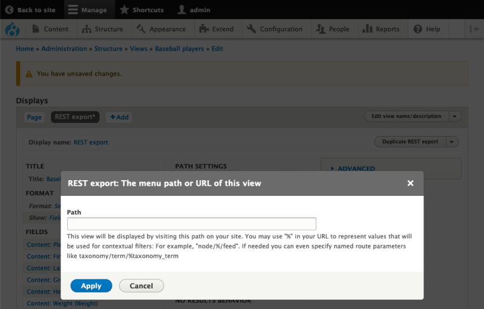

# Add a REST Endpoint with Viewsfree

## Content

One of the ways you can create a REST endpoint in Drupal is by using Views. In this tutorial, we'll add a REST endpoint display to a view of baseball players. We'll examine and configure settings that are unique to the REST endpoint display.

By the end of this tutorial you should be able to:

- Add a REST endpoint display to a view
- Understand how to configure settings for an endpoint

## Goal

Add a REST endpoint display to a view.

## Prerequisites

To follow along with this tutorial, you should have Drupal installed with our database starting point imported. This will start you out with content and views that you can work with in this tutorial.

- [Set up Demo Site with Views and Content](https://drupalize.me/tutorial/set-demo-site-views-and-content)

If you are new to Views, check out these User Guide tutorials as well:

- [Concept: Uses of Views](https://drupalize.me/tutorial/user-guide/views-concept?p=3083)
- [Concept: The Parts of a View](https://drupalize.me/tutorial/user-guide/views-parts?p=3083)

## Watch: Add a REST Endpoint with Views

Sprout Video

## Add a REST export display to the view of baseball players

With the help of some Drupal core modules, we can add a custom JSON endpoint to a Drupal site. In our case, we want to make our set of baseball players data consumable by other websites or apps. We'll do this by adding a new REST export display to our existing *Baseball Players* view.

To create a REST export display for a view, we need to install 2 modules. From the administration menu, navigate to Extend (*/admin/modules*).

### Install required modules

On *Extend*, locate the **Web Services** group of modules. Select the checkbox next to each of these modules (if not already selected), the select the *Install* button at the bottom of the page:

- RESTful Web Services
- Serialization

Image

### Edit view

Now we're ready to add a new display to our view. Navigate to the Structure > Views (*admin/structure/views*). From our list of views, locate the view named *Baseball Players* and select *Edit* in the *Operations* column.

Image

### Add a REST export display

Near the top of the page, locate the **Displays** area. We have one display, *Page*. Next to the display named *Page*, select the *+ Add* button to show a dropdown menu of the available display plugins.

Image

From the display dropdown list, select *REST export*. This will cause the page to reload. Once the reload is complete, there will be a new display, *REST export* listed on our view next to *Page*, which is now ready to edit in the Views UI. (When you add a new display to a view, the Views UI will automatically switch you to that new display.)

Image

(You'll see an error message that says that the display uses a path but the path is undefined. We'll be configuring the path in a later step.)

### Configure serializer format settings

Let's take a moment to look at the **Format** section of our view's edit page. The current format for our new display is *Serializer*. This means the output for this display is going to be text that represents a more complex data structure.

Next to the *Serializer* format, select the *Settings* link. This will open a new modal window where we can configure which serialization format we would like our view to output.

Image

Here we can configure the serialization format. Since we want our data to be available as JSON, select the checkbox labeled `json` beneath the **Accepted request formats** label. Select the *Apply* button.

Image

### Change format *Show* value from `Entity` to `Fields`

Still in the **Format** section of the edit screen, locate the *Show* label. By default it's set to `Entity`. We want to change that to `Fields` so that we have more control over the data provided to the REST export display.

Select the *Entity* link next to *Show* in the **Format** section.

Within the modal window, select the *Fields* radio button. Now select the *Apply (this display)* button.

Image

This will open a new modal window where we can configure how our data is output even further. Out of the box, the *REST export: Row style options* allow you to provide an alias for each field shown in our data. This is a useful setting for simplifying the output of our display for consumers, but for now select the *Apply* button to continue without configuring any aliases.

Image

### Configure display path

With our output configured, we need to provide a path for the our REST endpoint. In the **Path Settings** section of the view edit screen, locate the label *Path*. By default its value is `No path is set`. Select the *No path is set* link to set a path value.

Image

It's common practice to begin an API endpoint path with `api` followed by a version number, e.g. `v1` or `1.0`, then some path that describes the data. For example, we could set the path to `api/v1/baseball-players`.

Change the value of the *Path* field to `api/v1/baseball-players`, then select the *Apply* button.

Image

Now we are able to preview our display output. Scroll down to the **Preview** area. Notice that the view looks like a lot of plain text code. You might recognize the unformatted text as JSON. That's perfect! We've created a REST export display that outputs JSON data using the Views module.

Image

### Save the view

Select the *Save* button. Let's look at our new REST display in action.

There we have it. We've added a new REST export display to our view that provides a list of baseball players as JSON data. If we navigate to the path that we configured for our display, we can see our data output as JSON.

Image

Note: If you often find yourself reviewing JSON data in your browser, look for a good browser plugin that can make this data much easier to read. Here is a screenshot of the same dataset with a JSON browser extension enabled.

Image

## Recap

Adding displays to a view is a way to present an existing view in another way on your site. In this exercise we have learned a lot about adding displays to views by creating a new REST export display. Now our baseball player data has a consumable API, accessible to other systems, websites, and apps.

## Further your understanding

- Add REST export displays to our other views that display baseball data.

## Additional resources

- [What Are Web Services?](https://drupalize.me/tutorial/what-are-web-services) (Drupalize.Me)

Was this helpful?

Yes

No

Any additional feedback?

Previous
[Set up Demo Site with Views and Content](/tutorial/set-demo-site-views-and-content?p=2670)

Next
[Overview: Filter Criteria in Views](/tutorial/overview-filter-criteria-views?p=2670)

Clear History

Ask Drupalize.Me AI

close