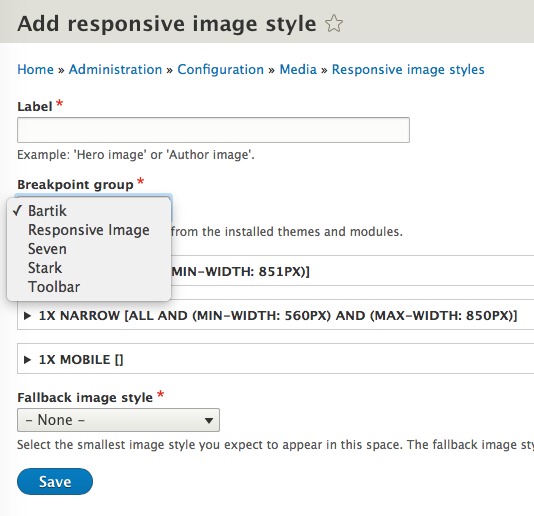
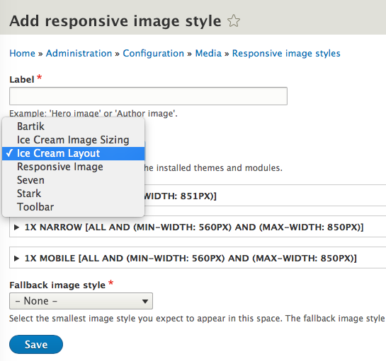

# What Is a Breakpoint YAML File?

## Content

Drupal's Breakpoint module defines a "breakpoint" [plugin type](https://drupalize.me/tutorial/what-are-plugins) that modules or themes can implement via a breakpoints configuration file. So, in order to make their breakpoints discoverable, themes and modules define their breakpoints in a *THEME-OR-MODULE.breakpoints.yml* file located in the root of their directory.

In this tutorial, you'll learn about the structure of a breakpoints configuration file and why you would want to use one. We’ll cover the kinds of metadata you can include in a breakpoint file, including key, label, mediaQuery, weight, multipliers, and breakpoint group. Throughout, we'll look at some examples of breakpoint configuration files available in Drupal themes and modules.

## Goal

Learn what a breakpoint configuration file is, how it's structured, and why you would want to use one.

## Prerequisites

- [Introduction to YAML](https://drupalize.me/videos/introduction-yaml) (Drupalize.Me)
- [Breakpoints and Media Queries](https://drupalize.me/tutorial/breakpoints-and-media-queries) (Drupalize.Me)

A [breakpoint](http://usecases.responsiveimages.org/#design-breakpoints) is one of a series of [CSS media queries](https://www.w3.org/TR/css3-mediaqueries/) which can update the styles of a page based on matching environmental conditions or [media features](http://usecases.responsiveimages.org/#dfn-media-features). (Responsive Image Community Group, W3C)

If you need a quick refresher on breakpoints and media queries, check out this related tutorial: [Breakpoints and Media Queries](https://drupalize.me/tutorial/breakpoints-and-media-queries).

## Breakpoints in Drupal

In Drupal, a site’s breakpoints can be exposed to other modules and themes in YAML format inside a breakpoints configuration file.

By exposing your site’s breakpoints in this way, other modules can create features that make use of breakpoints. One example of this is the Responsive Image module, which allows you to configure display settings on image fields to use responsive image styles. Responsive image styles are created using a settings form that enables you to configure how images in fields should respond to various breakpoints as defined in YAML files by themes or modules.

## Breakpoint configuration files

Drupal's Breakpoint module provides an API for other Drupal themes or modules to discover and utilize another theme's or module's breakpoints. Breakpoint module accomplishes this by defining a new "breakpoint" plugin type, which modules and themes can implement via a breakpoints YAML file.

So, in order to make their breakpoints discoverable, themes or modules can define their breakpoints in a *EXTENSION-NAME.breakpoints.yml* file located in the root of the theme or module's directory.

The YAML file provides a consistent way for extensions to make their breakpoints discoverable and usable by other themes or modules. The breakpoint YAML file describes information about a site's breakpoints. It doesn't replace or create media queries; rather, it describes and organizes a set of breakpoints using a structured format, so that this information can be used by other modules.

The Breakpoint module doesn't provide a UI for you to enter breakpoint information for your theme or module; you have to use a breakpoint YAML file.

## Name and location

Breakpoint configuration files use YAML format. They can be defined by a theme or module and should be placed in the root of the theme or module directory. Name the file using the following convention: *THEME-OR-MODULE-NAME.breakpoints.yml*.

For example, the Bartik theme's breakpoints file is *core/themes/bartik/bartik.breakpoints.yml* and the Toolbar module's breakpoints file is *core/modules/toolbar/toolbar.breakpoints.yml*.

## Structure

The breakpoint configuration file should contain an array of breakpoint metadata, keyed by an unique machine name that begins with the theme or module name, followed by the breakpoint label, for example `toolbar.narrow:`.

These breakpoint identifiers can also contain an optional group name. For example, if the *ice\_cream* theme wanted to create two groups of breakpoints, one for layout and one for image sizing, it could include a group name in the name of the key, i.e. `ice_cream.layout.mobile` or `ice_cream.imagesize.mobile`.

Each breakpoint should contain the following child keys:

- label
- mediaQuery
- weight
- multipliers
- group (optional)

For example:

```
bartik.mobile:
  label: mobile
  mediaQuery: ''
  weight: 0
  multipliers:
    - 1x
bartik.narrow:
  label: narrow
  mediaQuery: 'all and (min-width: 560px) and (max-width: 850px)'
  weight: 1
  multipliers:
    - 1x
bartik.wide:
  label: wide
  mediaQuery: 'all and (min-width: 851px)'
  weight: 2
  multipliers:
    - 1x
```

Let's take a closer look at each element of a breakpoints configuration file.

### Breakpoint identifier (machine name)

Each breakpoint is identified by a machine name. It should be the machine name of the theme or module followed by a dot (`.`) followed by a machine name of the label (which might be the same as the label value).

The breakpoint identifier machine name:

- Consists of the machine name of the theme or module, followed by an optional group name, and then a label, separated by a dot (`.`)
- Must start with a letter.
- Must contain only lowercase letters and underscores.
- Must be unique to your site, including any extensions you may download from drupal.org.
- May not be any of the reserved terms: `src, lib, vendor, assets, css, files, images, js, misc, templates, includes, fixtures, Drupal`.

Examples:

- `bartik.mobile`, `bartik.narrow`, `bartik.wide`
- `ice_cream.layout.mobile`, `ice_cream.layout.narrow`, `ice_cream.layout.wide`
- `responsive_image.viewport_sizing`
- `toolbar.narrow`, `toolbar.standard`, `toolbar.wide`

### Label

The `label` value is the label for your breakpoint, and should be unique within this file. You shouldn't have two breakpoints labeled "narrow", for example. This label will be run through the `t()` function to make it translatable.

Example: `label: mobile`

### Media Query

The `mediaQuery` value is the properly formatted media query, just as you would express it inside the `media` attribute.

Example: `mediaQuery: all and (min-width: 560px) and (max-width: 850px)`

The `mediaQuery` key is required, but you can indicate an empty value. The Responsive Image module does this in their breakpoint configuration file, which is suitable as a general-purpose viewport-sizing breakpoint that you can use when creating responsive image styles.

For example, in *core/modules/responsive\_image/responsive\_image.breakpoints.yml*:

```
responsive_image.viewport_sizing:
  label: Viewport Sizing
  mediaQuery: ''
  weight: 0
  multipliers:
    - 1x
```

### Weight

The `weight` key pertains to the order in which the media query would be executed. Breakpoints with the smallest min-width should be executed first, with higher values following. The first breakpoint should have a weight of `0`, followed by `1`, `2`, and so on. The weight value can be used by other modules that display your extension's breakpoints in a certain order. By default, this will be from smallest to largest weight, but modules can reverse that order programmatically.

Example: `weight: 0`

### Multipliers

A breakpoint's `multipliers` refer to the pixel resolution multipliers that represent the ratio between the physical pixel size of the active device and the device-independent pixel size. If you have styles supporting Android devices, for example, you would put `1.5x` and if you have support for OS X's "Retina" devices, use `2x`. Usually you will see `1x` used in core examples. For the `multipliers` key, list all multipliers that are supported by this breakpoint.

At a `1x` multiplier is always assumed and will be added by the Breakpoint module ([behind the scenes](https://api.drupal.org/api/drupal/core%21modules%21breakpoint%21src%21BreakpointManager.php/function/BreakpointManager%3A%3AprocessDefinition/)) if you do not specify it. It is best practice to include `1x` in your array of multipliers for clarity's sake.

Example:

```
    multipliers:
      - 1x
      - 2x
```

Take note of how the list of multipliers are indented under the `multipliers` key.

### Breakpoint group

As mentioned, you can organize your breakpoints further using groups. This is optional, but if you have breakpoints aligned with different purposes such as layout or delivering responsive images, you can group them accordingly. This might make it easier for other users to ascertain the purpose of each of your theme or module's breakpoints.

You can see how Responsive Image module uses the Breakpoint Group in its UI:

Image



By default, breakpoints are grouped by the extension name in the identifier key. But you can add a group name to your keys, after the extension name and before the breakpoint name, separated by a dot (`.`) and then your breakpoints will be organized by group. For example: `ice_cream.layout.mobile`.

Let's say we have a theme called "Ice Cream" which has styles for both responsive layout and responsive images. We can organize Ice Cream's breakpoints into two groups: "Ice Cream Layout" and "Ice Cream Image Sizing".

Take note of how each breakpoint identifier includes a machine-friendly group name between the theme name and the breakpoint label. Also note the addition of the `group` key with a human-friendly translatable group name for each breakpoint.

Example: *ice\_cream.breakpoints.yml*:

```
ice_cream.layout.mobile:
  label: mobile
  mediaQuery: ''
  weight: 0
  multipliers:
    - 1x
  group: Ice Cream Layout
ice_cream.layout.narrow:
  label: narrow
  mediaQuery: 'screen and (min-width: 750px)'
  weight: 1
  multipliers:
    - 1x
  group: Ice Cream Layout
ice_cream.layout.wide:
  label: wide
  mediaQuery: 'screen and (min-width: 1080px)'
  weight: 2
  multipliers:
    - 1x
  group: Ice Cream Layout

ice_cream.imagesize.mobile:
  label: mobile
  mediaQuery: 'screen and (max-width: 560px)'
  weight: 0
  multipliers:
    - 1x
  group: Ice Cream Image Sizing
ice_cream.imagesize.narrow:
  label: narrow
  mediaQuery: 'all and (max-width: 960px)'
  weight: 1
  multipliers:
    - 1x
  group: Ice Cream Image Sizing
ice_cream.imagesize.wide:
  label: wide
  mediaQuery: 'all and (min-width: 961px)'
  weight: 2
  multipliers:
    - 1x
  group: Ice Cream Image Sizing
```

Since all breakpoints on the Drupal site can be collated together, it's best practice to include your extension name in the human-friendly group name, so that it can be differentiated from others.

For example, see in the following screenshot how the Responsive Image module utilizes these breakpoint group labels in its UI. You can see from this example why it's important to include your theme name in a group label so that you can easily locate it in a form field that collates all enabled breakpoint groups.

Image



## Add to another theme or module's breakpoint group

You can take advantage of the fact that Drupal collates all breakpoints on a site by adding to the breakpoints of another theme or module's breakpoint groups.

Let's say you have a theme on your site called *ice\_cream* and a module on your site called *flavors*. The *flavors* module wants to add a "superwide" breakpoint to the "Ice Cream Image Sizing" group. The *flavors* module's `flavors.breakpoints.yml` includes a breakpoint identifier that includes the `ice_cream.imageresize` ID, which tells Drupal to add this breakpoint to the `ice_cream.imageresize` group.

Example: *flavors.breakpoints.yml*:

```
flavors.ice_cream.imageresize.superwide
  label: superwide
  mediaQuery: '(min-width: 1501px)'
  weight: 1
  multipliers:
    - 1x
    - 2x
  group: Ice Cream Image Sizing
```

Now, when the Flavors module is enabled, this breakpoint will be added to the Ice Cream Image Sizing breakpoint group.

## Recap

In this tutorial, we learned about the breakpoint configuration file, its structure, what each key means, how to organize breakpoints into groups, and how to add to another theme or module's breakpoint groups. Along the way we looked at both examples from core and fictitious examples that demonstrated the different ways a breakpoint configuration file can be structured.

## Further your understanding

- Enable Responsive Image module, go to its configuration settings page, and click on the "Add a new responsive image style" button. Verify that your custom theme's breakpoints are listed in the Breakpoint group field.
- Apply your understanding of breakpoint configuration files by creating a new responsive image style. Learn more about responsive image styles in the following tutorials: [Responsive Image Module Overview](https://drupalize.me/tutorial/responsive-image-module-overview), [Responsive Image Style Use Cases](https://drupalize.me/tutorial/responsive-image-style-use-cases), [Create a Responsive Image Style for Viewport-Sizing](https://drupalize.me/tutorial/create-responsive-image-style-viewport-sizing).

## Additional resources

- [What Are Plugins?](https://drupalize.me/tutorial/what-are-plugins) (Drupalize.Me)
- [Introduction to YAML](https://drupalize.me/videos/introduction-yaml) (Drupalize.Me)
- [Breakpoints and Media Queries](https://drupalize.me/tutorial/breakpoints-and-media-queries) (Drupalize.Me)
- [Sharing Breakpoints Between Drupal 8 and Sass](https://www.lullabot.com/articles/sharing-breakpoints-between-drupal-8-and-sass) (lullabot.com)

Was this helpful?

Yes

No

Any additional feedback?

Previous
[Breakpoints and Media Queries](/tutorial/breakpoints-and-media-queries?p=3275)

Next
[Create a Breakpoint YAML File](/tutorial/create-breakpoint-yaml-file?p=3275)

Clear History

Ask Drupalize.Me AI

close