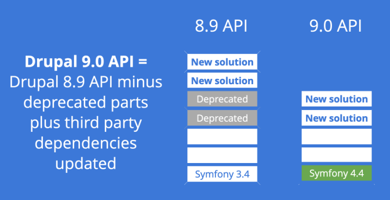
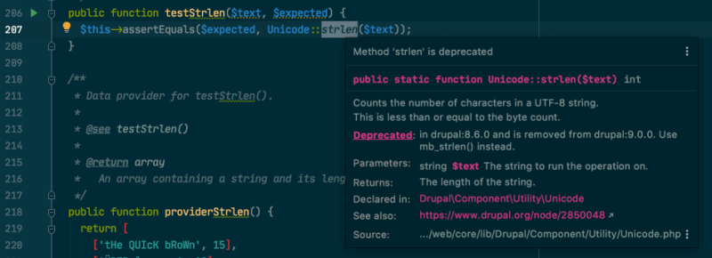

# What Is Deprecated Code?free

## Content

Deprecated code is any code flagged for future removal, but which has not yet been removed to ensure that existing code which relies on the to-be-removed code will continue to work. When an API, or feature, becomes deprecated it's a warning to all developers that at some point in the future this thing they are relying on will not exist, and they'll need to update their custom code to a new approach. Preferably before the existing one gets removed.

In this tutorial well:

- Learn about why, and when, code is deprecated in Drupal
- How to identify custom code that is using deprecated features
- How to determine an appropriate upgrade path to the new API

By the end of this tutorial you should be able to explain what code deprecation is, and why it's important for Drupal's continue innovation, as well as how to update your own code when an API you rely on becomes deprecated.

## Goal

Explain code deprecation, and how to know when your custom code is relying on a deprecated API.

## Prerequisites

- None.

## Why deprecate an API?

In order to allow Drupal core to innovate on its API and feature set, developers need to be able to change the code. But, contributed modules, and site-specific custom code, often relies on being able to call Drupal core's APIs and make use of the provided features. This makes it hard to change the Drupal core code because you also have to ensure that you're not breaking anyone else's code when doing so.

Code gets deprecated for lots of reasons:

- Sometimes Drupal was working around a bug, or missing feature, in PHP. But now PHP provides a complete, and probably much more efficient, solution and Drupal should start using that.
- Sometimes an entire module, like Place Block, has its feature set replaced with a better solution (Layout Builder) and we want to remove the old module to lessen the maintenance burden.
- Other times static functions like `drupal_set_message()` are replaced by dynamic services like `\Drupal\Core\Messenger\MessengerInterface::addMessage()`
- Or maybe the name of something is changed to better reflect what it's doing and improve the developer experience

Read the [Drupal core deprecation policy](https://www.drupal.org/core/deprecation) for more details.

## What happens when code gets deprecated

When a new feature is added, and an old one is marked as deprecated, you can expect a few things to happen. An `@deprecated` PHP comment is added to the old code, and documentation about what's replacing it is provided via an `@see` comment. This varies a bit for non-PHP code, but the flag and documentation are still present. And [a change record](https://www.drupal.org/list-changes) gets created.

In PHP code the `trigger_error()` function gets used with the `E_USER_DEPRECATED` flag where possible. This makes PHP output messages about deprecated code to the log.

In this example the `\Drupal\Component\Utility\Unicode::strlen` method got deprecated in Drupal 8.6.x in favor of the polyfill for `mb_string()` provided by Symfony:

```
/**
  * ... <snip> ...
  *
  * @deprecated in drupal:8.6.0 and is removed from drupal:9.0.0. Use
  *   mb_strlen() instead.
  *
  * @see https://www.drupal.org/node/2850048
  */
public static function strlen($text) {
  @trigger_error('\Drupal\Component\Utility\Unicode::strlen() is deprecated in Drupal 8.6.0 and will be removed before Drupal 9.0.0. Use mb_strlen() instead. See https://www.drupal.org/node/2850048.', E_USER_DEPRECATED);
  return mb_strlen($text);
}
```

For a developer, this means your code should stop calling `\Drupal\Component\Utility\Unicode::strlen`, and use `mb_strlen()` instead. It's a drop-in replacement, as evidenced by the fact that at this point `\Drupal\Component\Utility\Unicode::strlen` is nothing but a wrapper around the new function.

You can see how this code has evolved over time:

- [Drupal 8.5.x version](https://api.drupal.org/api/drupal/core%21lib%21Drupal%21Component%21Utility%21Unicode.php/function/Unicode%3A%3Astrlen/8.5.x)
- [Drupal 7 version](https://api.drupal.org/api/drupal/includes%21unicode.inc/function/drupal_strlen/7.x)

Eventually, deprecated code will be removed in order to reduce the maintenance burden and pave the way for more innovation. In the case of Drupal this will usually correspond with a major version release.

Image



Slide from [State of Drupal 9](http://hojtsy.hu/blog/2020-mar-16/whole-new-version-open-source-state-drupal-9-slideshow-present-it-yourself) by Gábor Hojtsy.

## Finding uses of deprecated APIs in your custom code

As a developer, all you need to do is find all instances where your code is relying a deprecated API or feature, and update it to the new version. Thankfully there are some handy tools to help you.

We recommend using an IDE like PHPStorm that can provide recommendations about the use of deprecated code in real time.

Example:

Image



The [drupal-check](https://github.com/mglaman/drupal-check) utility can be used to scan a codebase and provide reports about use of deprecated features. [Learn more about using drupal-check](https://drupalize.me/blog/jump-start-your-drupal-9-code-updates-drupal-check-and-drupal-rector).

And, the [Upgrade Status](https://www.drupal.org/project/upgrade_status) module can be installed in a latest-Drupal codebase to run drupal-check, and additional built in analyzers that understand Drupal's theme's, asset libraries, and more. [Learn more about using Upgrade Status](https://drupalize.me/blog/start-drupal-9-readiness-do-list-using-upgrade-status).

Consider adding an automated checks for deprecated code by running one of the above CLI tools as part of a continuous integration process. Or [as a Git commit policy](https://www.lullabot.com/articles/how-enforce-drupal-coding-standards-git).

Or you can [configure your test suite to fail](https://www.drupal.org/docs/9/how-to-prepare-your-drupal-7-or-8-site-for-drupal-9/deprecation-checking-and-correction-tools) whenever deprecated code is executed.

## Fix your code

Finally, once you've identified the places in your own code that are using deprecated APIs, you'll want to update them.

Look for an `@see` block in the comments that points to a change record. These usually exist, and usually do a good job of explaining what updates are necessary.

You can also the features built into Upgrade Status, or drupal-rector to help automate some of this. These tools can find commonly used deprecated function calls, like `drupal_set_message()` and replace them. It still requires you to manually review the updates, but can help speed up the process. [Learn more about using drupal-rector](https://drupalize.me/blog/jump-start-your-drupal-9-code-updates-drupal-check-and-drupal-rector).

## Recap

In this tutorial we learned that code in Drupal core is deprecated in order to allow for continued innovation and the addition of new and improved features. When this happens the old code is flagged with an `@deprecated` (or similar) comment and documentation about what changed and how to update your code is provided via a change record. In order to ensure your custom code remains compatible with future versions of Drupal you should continually check for use of deprecated APIs and remove them.

## Further your understanding

- Use drupal-check to scan your codebase. Are you using any deprecated APIs? What's involved in updating them?
- When should you update your code to use a newer version of an API?

## Additional resources

- [Drupal core deprecation policy](https://www.drupal.org/core/deprecation) (Drupal.org)
- [How and why we deprecate on the way to Drupal 9](https://www.drupal.org/docs/9/how-drupal-9-is-made-and-what-is-included/how-and-why-we-deprecate-on-the-way-to-drupal-9) (Drupal.org)
- [Use a deprecation process for JavaScript similar to what we use for PHP code](https://www.drupal.org/project/drupal/issues/2918868) (Drupal.org)

Was this helpful?

Yes

No

Any additional feedback?

Next
[Upgrade to Drupal 11](/tutorial/upgrade-drupal-11?p=3282)

Clear History

Ask Drupalize.Me AI

close