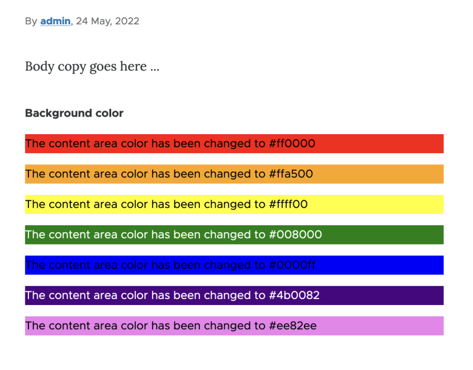
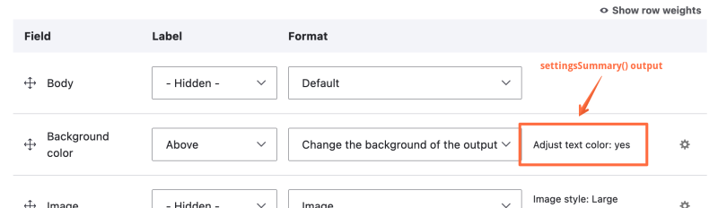

# Define a Field Formatter Plugin

## Content

Field formatters are responsible for taking the data stored by a field and transforming it into what a visitor sees. We can define new field formatters to output data for new field types or to provide alternative formatting options for existing field types. Creating a field formatter plugin is a common task for Drupal developers.

In this tutorial we'll:

- Define a new background color field formatter that uses the string stored by our *field\_example\_rgb* field type as the background color of the output.
- Make it possible for site builders to toggle on or off a feature that automatically adjusts the foreground text color of the output.

By the end of this tutorial you should be able to define a new custom field formatter plugin with settings that a site administrator can configure.

## Goal

Define a custom *color* field formatter that outputs an RGB hex string as either plain text, or text with the background color set to the value of the field.

## Prerequisites

- [Field Types](https://drupalize.me/tutorial/field-types)
- [Field Formatters](https://drupalize.me/tutorial/field-formatters)
- [Implement a Plugin Using PHP Attributes](https://drupalize.me/tutorial/implement-plugin-using-php-attributes)

## Create a field formatter plugin

In [Field Types](https://drupalize.me/tutorial/field-types) we defined a `field_example_rgb` field type. In this tutorial we'll provide a new formatter specific to that field type. The formatter will be able to output the field content in 1 of 2 ways.

A simple string like this:

<drupal-media data-entity-type="media" data-entity-uuid="29c25d04-5151-4742-a81d-5e6111adee17" alt="Text that says "The color code in this field is #137cc1" and the text itself is that color">

Or a string with the background color set:

Image


### Determine where the code should go

Field formatters are plugins the use `\Drupal\Core\Field\Attribute\FieldFormatter` attributes, that implement the `\Drupal\Core\Field\FormatterInterface`, and extend the `\Drupal\Core\Field\FormatterBase` base class. For a refresher on how to implement plugins, see [Implement a Plugin Using PHP Attributes](https://drupalize.me/tutorial/implement-plugin-using-php-attributes).

Based on this we can infer that our code should be in the file *{MODULE\_NAME}/src/Plugin/Field/FieldFormatter/ColorBackgroundFormatter.php*. Replace `{MODULE_NAME}` with the machine name of your module. In this tutorial, our example module is called `field_example`, so our code will go in the file *field\_example/src/Plugin/Field/FieldFormatter/ColorBackgroundFormatter.php*.

### Define the plugin class

Many formatter plugins only need to implement the `viewElements()` method, loop over the values extracted from the field type storage, and format them as a [renderable array](https://drupalize.me/tutorial/what-are-render-arrays).

Example *ColorBackgroundFormatter.php*:

```
<?php

namespace Drupal\field_example\Plugin\Field\FieldFormatter;

use Drupal\Core\Field\Attribute\FieldFormatter;
use Drupal\Core\Field\FormatterBase;
use Drupal\Core\Field\FieldItemListInterface;
use Drupal\Core\StringTranslation\TranslatableMarkup;

/**
 * Plugin implementation of the 'field_example_color_background' formatter.
 */
#[FieldFormatter(
  id: "field_example_color_background",
  label: new TranslatableMarkup("Change the background of the output text"),
  field_types: ["field_example_rgb"]
)]
class ColorBackgroundFormatter extends FormatterBase {

  /**
   * {@inheritdoc}
   */
  public function viewElements(FieldItemListInterface $items, $langcode) {
    $elements = [];

    foreach ($items as $delta => $item) {
      $elements[$delta] = [
        '#type' => 'html_tag',
        '#tag' => 'p',
        '#value' => $this->t('The content area color has been changed to @code', ['@code' => $item->value]),
        '#attributes' => [
          'style' => 'background-color: ' . $item->value,
        ],
      ];
    }
    return $elements;
  }

}
```

In this code the `viewElements()` method iterates over the field values in `$items` and creates a new render array `$elements` with 1 entry for each value. The render array defines the output as a `p` tag with the `style` attribute set to the value of the field. For example `<p style="background-color: #137cc1">`. Because fields can hold one or more values depending on how they were configured by the site builder, you'll always want to use this pattern of looping over the items and building a render array that contains each one.

The `field_types` parameter of the `\Drupal\Core\Field\Attribute\FieldFormatter` attribute is also important to pay attention to. This determines what field type(s) the formatter will work with. It's a list of field type plugin IDs. The one in this example says this formatter will only work with fields of the type `field_example_rgb`.

## Make the field formatter configurable

Field formatters can also optionally provide additional configuration settings for site builders. The image field formatter for example allows you to choose which image style to use when rendering an image. Let's add a configuration option to our field formatter that will allow a site builder to choose whether the foreground color should automatically switch between white and black depending on the lightness of the background color provided (hopefully making things easier to read).

Example settings form:

Image


Example of output with the foreground color adjustment enabled:

Image



### Define your configuration schema

We need to tell Drupal about the new configuration values we're adding. Add to or create a [configuration schema](https://drupalize.me/tutorial/configuration-data-types) file for your module if it doesn't already exist.

Example *field\_example/config/schema/field\_example.schema.yml*:

```
# Relates to the field_example_color_background formatter plugin.
# \Drupal\field_example\Plugin\Field\FieldFormatter\ColorBackgroundFormatter.
field.formatter.settings.field_example_color_background:
  type: mapping
  label: Background color formatter settings
  mapping:
    adjust_text_color:
      type: boolean
      label: Automatically adjust foreground text color based on background color lightness.
```

The top level key should follow the pattern: `field.formatter.settings.{PLUGIN_ID}` where `PLUGIN_ID` is the ID of the field formatter plugin that this setting applies to. Find this in the plugin's attribute.

### Update the plugin code

Next, we need to add a UI for site builders to configure this new setting. This involves defining the form element(s), and providing a summary of the current configuration. And then finally making use of the setting in the logic for displaying the background color.

Example *ColorBackgroundFormatter.php* with configurable settings:

```
<?php

namespace Drupal\field_example\Plugin\Field\FieldFormatter;

use Drupal\Core\Field\Attribute\FieldFormatter;
use Drupal\Core\Field\FormatterBase;
use Drupal\Core\Field\FieldItemListInterface;
use Drupal\Core\StringTranslation\TranslatableMarkup;

/**
 * Plugin implementation of the 'field_example_color_background' formatter.
 */
#[FieldFormatter(
  id: "field_example_color_background",
  label: new TranslatableMarkup("Change the background of the output text"),
  field_types: ["field_example_rgb"]
)]
class ColorBackgroundFormatter extends FormatterBase {

  /**
   * {@inheritdoc}
   */
  public function viewElements(FieldItemListInterface $items, $langcode) {
    $elements = [];

    foreach ($items as $delta => $item) {
      $text_color = 'inherit';
      if ($this->getSetting('adjust_text_color')) {
        $text_color = $this->lightness($item->value) < 50 ? 'white' : 'black';
      }

      $elements[$delta] = [
        '#type' => 'html_tag',
        '#tag' => 'p',
        '#value' => $this->t('The content area color has been changed to @code', ['@code' => $item->value]),
        '#attributes' => [
          'style' => 'background-color: ' . $item->value . '; color: ' . $text_color,
        ],
      ];
    }
    return $elements;
  }

  /**
   * {@inheritdoc}
   */
  public static function defaultSettings() {
    // Set default values for the formatter's configuration. The keys of this
    // array should match the form element names in ::settingsForm(), and the
    // schema defined in config/schema/field_example.schema.yml.
    return [
        'adjust_text_color' => TRUE,
      ] + parent::defaultSettings();
  }

  /**
   * {@inheritdoc}
   */
  public function settingsForm(array $form, FormStateInterface $form_state) {
    // Create a new array with one or more form elements to add to the formatter
    // configuration form that is exposed when a user clicks the gear icon to
    // configure a field formatter on the manage display page for an entity
    // type.
    $elements = [];

    // The keys of the array, 'adjust_text_color' in this case, should match
    // what is defined in ::defaultSettings(), and the field_example.schema.yml
    // schema. The values collected by the form will be automatically stored
    // as part of the field instance configuration, so you do not need to
    // implement form submission processing.
    $elements['adjust_text_color'] = [
      '#type' => 'checkbox',
      // The current configuration for this setting for the field instance can
      // be accessed via $this->getSetting().
      '#default_value' => $this->getSetting('adjust_text_color'),
      '#title' => $this->t('Adjust foreground text color'),
      '#description' => $this->t('Switch the foreground color between black and white depending on lightness of the background color.'),
    ];
    return $elements;
  }

  /**
   * {@inheritdoc}
   */
  public function settingsSummary() {
    // This optional summary text is displayed on the manage displayed in place
    // of the formatter configuration form when the form is closed. You'll
    // usually see it in the list of fields on the manage display page where
    // this formatter is used.
    $state = $this->getSetting('adjust_text_color') ? $this->t('yes') : $this->t('no');
    $summary[] = $this->t('Adjust text color: @state', ['@state' => $state]);
    return $summary;
  }

  /**
   * Determine lightness of a color.
   *
   * This might not be the best way to determine if the contrast between the
   * foreground and background colors is legible. But it'll work well enough for
   * this demonstration.
   *
   * Logic from https://stackoverflow.com/a/12228730/8616016.
   *
   * @param string $color
   *   A color in hex format, leading '#' is optional.
   *
   * @return float
   *   Percentage of lightness of the provided color.
   */
  protected function lightness(string $color) {
    $hex = ltrim($color, '#');
    // Convert the hex string to RGB.
    $r = hexdec($hex[0].$hex[1]);
    $g = hexdec($hex[2].$hex[3]);
    $b = hexdec($hex[4].$hex[5]);

    // Calculate the HSL lightness value and return that as a percent.
    return ((max($r, $g, $b) + min($r, $g, $b)) / 510.0) * 100;
  }

}
```

In the above code we added 3 new methods:

- `defaultSettings()` which provides default values for the configuration when none is provided.
- `settingsForm()` which defines the new form elements a user will see on the field formatter configuration form. See the screenshot above for an example.
- `settingsSummary()` which provides an optional summary of the current configuration of the formatter for a specific field instance.

Example of `settingsSummary()` output:

Image



Then we updated the `viewElements()` method to make use of our new configuration. The current configured value for the setting can be accessed using the `$this->getSetting()` method. In our case, this returns a boolean value which we can use as part of an if/else statement to determine if we should set the foreground color or not.

## Test it out

To see your new field formatter in action you'll need to first add an `field_example_rgb` field to any entity type (like the *article* content type). Then navigate to the *Manage display* page for that entity type, ensure the field you added is in the list of active fields for the view mode, and choose your new formatter from the options listed for the field.

## Recap

In this tutorial, we defined a new custom, configurable, field formatter plugin. The plugin works with `field_example_rgb` type fields. Instead of displaying the string stored by the field as a simple value, it treats the value as a background color and applies it to the field. We also provided an optional configuration setting that allows a site builder to toggle on or off a feature that attempts to adjust the foreground color depending on the lightness of the background color. Then we enabled and configured the new field formatter to see it in action.

## Further your understanding

- What's an example use case for creating a custom field formatter plugin that extends one of the existing formatters provided by core?
- Can you adjust the code for this field formatter so that it'll work with core's generic string fields as well as our custom `field_example_rgb` field?
- How could you adjust the code for this plugin so that it uses 1 or more services via dependency injection?

## Additional resources

- [Field Formatter API](https://api.drupal.org/api/drupal/core%21modules%21field%21field.api.php/group/field_formatter/) (api.drupal.org)
- [Create a custom field formatter](https://www.drupal.org/docs/creating-custom-modules/creating-custom-field-types-widgets-and-formatters/create-a-custom-field-formatter) (Drupal.org)
- [Configuration schema / metadata](https://www.drupal.org/node/1905070) (Drupal.org)
- [Configuration Data Types](https://drupalize.me/tutorial/configuration-data-types) (Drupalize.Me)
- [PHP Attributes](https://drupalize.me/tutorial/php-attributes) (Drupalize.Me)

Was this helpful?

Yes

No

Any additional feedback?

Previous
[Field Formatters](/tutorial/field-formatters?p=2628)

Next
[Field API Hooks](/tutorial/field-api-hooks?p=2628)

Clear History

Ask Drupalize.Me AI

close